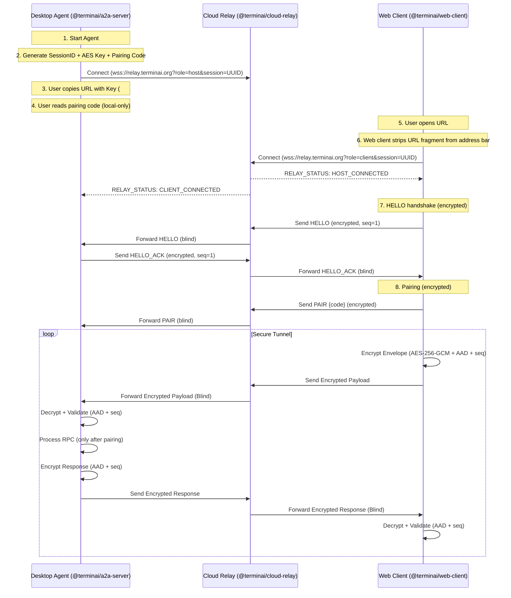

# Cloud Relay Architecture & Implementation

This document details the architecture, security model, and implementation of
the **TerminaI Cloud Relay**, a system providing secure remote access to the
TerminaI agent without requiring complex network configuration (port forwarding)
or trusting a central server with sensitive data.

## 1. High-Level Architecture

The system follows a **Zero-Trust Relay** pattern. The Cloud Relay acts as a
dumb pipe, blind to the content of the traffic it forwards. All authentication
and encryption happen strictly between the **Host** (Desktop Agent) and the
**Client** (Web Browser).



### Key Components

1.  **Desktop Agent (`@terminai/a2a-server`)**: The authoritative host. It
    initiates the session, generates encryption keys, and executes agent
    commands.
2.  **Cloud Relay (`@terminai/cloud-relay`)**: A lightweight, stateless
    WebSocket server deployed to the cloud (e.g., Google Cloud Run). It routes
    messages based on `sessionID`.
3.  **Web Client (`@terminai/web-client`)**: The user interface running in the
    browser. It performs client-side encryption/decryption using the Web Crypto
    API.

---

## 2. Security Model (Zero Trust)

The architecture is designed so that **compromising the Relay Server does NOT
compromise user sessions.**

- **End-to-End Encryption (E2EE):** All traffic is encrypted using
  **AES-256-GCM**.
- **Key Distribution:** The encryption key is generated ephemerally by the
  Desktop Agent and encoded in the URL **fragment** (hash).
  - Example: `https://terminai.org/remote#session=...&key=...`
  - Browsers do _not_ send the fragment to the web server serving the client.
  - The Desktop Agent and Web Client never send the key to the Relay Server.
- **Ephemeral Sessions:** Keys and Session IDs are generated fresh on every
  agent startup. There are no long-lived "master passwords."

### Additional Hardenings

- **Anti-replay & ordering:** Every encrypted message is wrapped in a versioned
  envelope that includes a strict, monotonic per-direction `seq`. Both sides
  reject out-of-order or replayed sequences.
- **AEAD binding (AAD):** AES-GCM uses Additional Authenticated Data to bind
  ciphertext integrity to the `sessionId`, protocol version, and message
  direction.
- **Handshake gate:** The host refuses to process RPC until a
  `HELLO`/`HELLO_ACK` handshake completes.
- **Pairing gate:** The host requires a local pairing code (displayed on the
  host) before allowing remote RPC execution.

### Encryption Protocol

- **Algorithm:** AES-256-GCM
- **Key Length:** 256 bits (32 bytes)
- **IV (Initialization Vector):** 12 bytes, randomized per message.
- **Auth Tag:** 16 bytes, appended to ciphertext for integrity verification.
- **Payload Format:**
  `[ IV (12 bytes) ] [ Tag (16 bytes) ] [ Ciphertext (N bytes) ]`

---

## 3. Implementation Details

The implementation is split across three packages in the monorepo.

### A. Cloud Relay Service (`packages/cloud-relay`)

A minimal Node.js WebSocket server.

- **File:** `src/server.ts`
- **Logic:**
  - Maintains a `Map<SessionID, { host: WebSocket, client: WebSocket }>` in
    memory.
  - **Role-based Connection:** Handlers for `?role=host` and `?role=client`.
    - **Session creation rules:** Sessions are created on `role=host` connect.
      `role=client` connects to unknown sessions are rejected.
  - **Message Routing:** Simply forwards messages:
    - `Host -> Relay -> Client`
    - `Client -> Relay -> Host`
  - **Resilience:**
    - **Heartbeat:** Pings all connections every 30s. Terminates if no pong in
      60s.
    - **Rate Limiting:**
      - Max concurrent connections per IP.
      - Max new connections per minute per IP.
      - Global max sessions (counted as sessions with active host).
      - Max WebSocket payload size.
      - Per-connection and per-IP throughput caps (msgs/sec, bytes/sec).
    - **Health/metrics:**
      - `GET /health` returns basic JSON health + counts.
      - `GET /metrics` exposes basic Prometheus-style metrics.

### B. Desktop Agent Integration (`packages/a2a-server`)

The "Host" side of the connection.

- **File:** `src/http/relay.ts`
- **Logic:**
  - **`connectToRelay(relayUrl, requestHandler)`**:
    1.  Creates a `RelaySession` containing:
        - `sessionId` (UUIDv4)
        - `key` (32-byte random AES key)
        - `pairingCode` (6 digits)
    2.  Connects to Relay via WebSocket (`role=host`).
    3.  Logs the share URL only when `PRINT_RELAY_URL=true`.
    4.  Always logs the pairing code locally.
    5.  Reconnects with exponential backoff while reusing the same session.
  - **Message Handling:**
    1.  Receives encrypted frames.
    2.  Decrypts using AES-256-GCM **with AAD**.
    3.  Validates the versioned envelope and strict `seq`.
    4.  Requires `HELLO`/`HELLO_ACK` handshake.
    5.  Requires `PAIR` before executing `RPC`.
    6.  Executes `requestHandler.handle()` on the decrypted RPC payload.
    7.  Encrypts responses in an envelope with AAD + `seq`.
- **File:** `src/http/app.ts`
  - Checks for `WEB_REMOTE_RELAY_URL` environment variable.
  - If present, initiates the relay connection on startup alongside the local
    HTTP server.

### C. Web Client Integration (`packages/web-client`)

The "Client" side running in the browser.

- **File:** `relay-client.js`
- **Class:** `RelayClient`
- **Logic:**
  - **Initialization:** Parsed `sessionId` and `key` from the URL hash.
  - **Leakage prevention:** The web client strips the URL fragment from the
    address bar after parsing.
  - **Web Crypto API:** Uses `window.crypto.subtle` for performant, native
    encryption/decryption in the browser.
  - **`importKey()`**: Converts the base64 URL-safe key into a `CryptoKey`
    object.
  - **Handshake:** Sends `HELLO` on connection open and requires `HELLO_ACK`
    before sending RPC.
  - **Encryption:** AES-256-GCM with `additionalData` (AAD) and strict `seq`.
  - **Pairing:** Sends `PAIR` with the user-entered pairing code.

---

## 4. User Journey

1.  **Setup:** User deploys the relay (or uses a public one) and sets the
    environment variable:

    ```bash
    export WEB_REMOTE_RELAY_URL=wss://relay.terminai.org
    ```

2.  **Start:** User runs the agent:

    ```bash
    terminai start
    ```

3.  **Discovery:** The CLI prints a secure Remote Access URL:

    ```
    [Relay] Remote Access URL: https://terminai.org/remote#session=abc-123&key=xyz-secret&relay=wss%3A%2F%2Frelay.terminai.org
    ```

    By default, the host may **not** print the full URL unless:

    ```bash
    export PRINT_RELAY_URL=true
    ```

    The host prints a **pairing code** locally (required):

    ```
    [Relay] Pairing Code: 123456 (required for first connection)
    ```

4.  **Connection:**
    - User opens the link on their phone/tablet.
    - The Web Client loads (static HTML/JS from terminai.org).
    - The Web Client detects the `#hash` params.
    - It initiates a WebSocket connection to `wss://relay.terminai.org` using
      the Session ID.
    - The `RelayClient` derives the encryption key ready for traffic.

5.  **Interaction:**
    - User completes pairing (enters the pairing code shown on the host).
    - User types "List my files".
    - Web Client encrypts an `RPC` envelope.
    - Relay forwards the blob.
    - Agent decrypts, validates seq/AAD, executes the command, and encrypts the
      result.
    - Web Client receives blob, decrypts, and displays the file listing.

---

## 5. Deployment Considerations

While the architecture is agnostic, the default deployment targets **Google
Cloud Run** for the relay.

- **Stateless:** The relay holds sessions in memory. Cloud Run's stateless
  nature works well provided we use **Session Affinity** (sticky sessions) if
  scaling beyond 1 instance, or rely on the low cost of a single instance
  (handling 1000+ sessions easily).
- **Scale:**
  - A single container (1 vCPU, 512MB RAM) can comfortably handle thousands of
    concurrent WebSocket tunnels.
  - Cost is minimal (~$2-5/month for typical usage) due to efficient WebSocket
    handling.
- **Health Checks:**
  - Exposes `/health` endpoint for load balancers.
  - Exposes `/metrics` for basic operational visibility.

## 6. Protocol Specification

For collaborators building new clients or debugging:

### Encrypted Frame Format (Binary)

Every WebSocket message (binary) follows this strict layout:

| Segment        | Size     | Description                                    |
| :------------- | :------- | :--------------------------------------------- |
| **IV**         | 12 bytes | Initialization Vector (randomized per message) |
| **Auth Tag**   | 16 bytes | GCM Authentication Tag (integrity check)       |
| **Ciphertext** | N bytes  | Encrypted JSON payload                         |

### Decrypted Payload (JSON)

Once decrypted, the payload is a versioned envelope:

```json
{
  "v": 1,
  "type": "HELLO" | "HELLO_ACK" | "PAIR" | "RPC" | "EVENT" | "ERROR",
  "dir": "c2h" | "h2c",
  "seq": 1,
  "ts": 1735080000000,
  "payload": {}
}
```

`RPC.payload` typically contains an A2A JSON-RPC request.

### AEAD AAD String

Both client and host bind integrity to session + direction using an AAD string:

```text
terminai-relay|v=1|session=<uuid>|dir=<c2h|h2c>
```

This AAD is supplied as:

- Node: `cipher.setAAD(...)`, `decipher.setAAD(...)`
- Browser: `additionalData` in WebCrypto AES-GCM

```json
{
  "jsonrpc": "2.0",
  "method": "agent.listDirectory",
  "params": { "path": "/" },
  "id": 1
}
```

### Control Messages (Unencrypted)

The Relay may send unencrypted JSON control messages to both roles:

```json
{
  "type": "RELAY_STATUS",
  "status":
    | "HOST_CONNECTED"
    | "HOST_DISCONNECTED"
    | "CLIENT_CONNECTED"
    | "CLIENT_DISCONNECTED"
}
```

---

## 7. Local Development Guide

To run the full E2E system locally for development:

1.  **Start the Relay (Port 8080):**

    ```bash
    npm run start --workspace @terminai/cloud-relay
    ```

2.  **Start the Agent (Port 41242, pointing to local relay):**

    ```bash
    export WEB_REMOTE_RELAY_URL=ws://localhost:8080
    npm run start --workspace @terminai/a2a-server
    ```

    Optionally print the full share URL:

    ```bash
    export PRINT_RELAY_URL=true
    ```

    _Copy the `[Relay] Remote Access URL` printed in the logs._

3.  **Start the Web Client:**

    ```bash
    # Serve the static files
    npx http-server packages/web-client -p 8000
    ```

4.  **Connect:** Open the copied URL in your browser, but replace
    `https://terminai.org` with `http://localhost:8000`.

---

## 8. Future Improvements

- **True streaming over relay:** Emit `EVENT` frames mirroring SSE events for
  token-by-token output.
- **QR Code:** The CLI could render a QR code in the terminal for easier mobile
  scanning.
- **Stronger session recovery:** Make reconnect+rehydration robust even when
  only one side reconnects.
- **Multi-instance routing:** Redis pub/sub routing to remove sticky-session
  dependencies at scale.
- **Expanded metrics:** Rate-limit counters, close reasons, bytes in/out.
