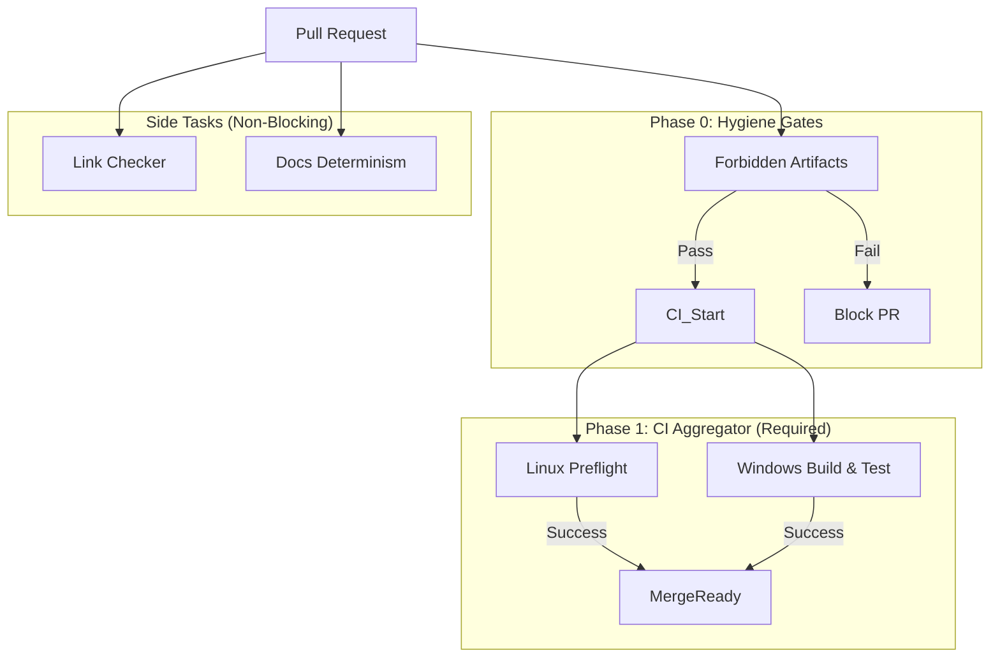

# Architecture: CI Hardening & Reliability (Days 7-20)

**Date:** 2026-01-23 **Status:** DRAFT

## 1. Executive Summary

**What:** We are rebuilding the CI/CD pipeline to be deterministic,
cross-platform (Windows/Linux), and noise-free. This covers Days 7-20 of the
roadmap. **Why:** Current CI is flaky, fails on Windows, and blocks merges for
irrelevant reasons (link rot). This prevents safe iteration and high-velocity
shipping. **When:** Execution over 14 days (Days 7-20). **Risk:** Breaking valid
PRs if gates are too strict initially; masking real regressions if gates are
removed without replacement. Mitigation: Staged rollout (Phase 0-5) and "fail
open" defaults where appropriate until proven.

## 2. Architecture Overview

### System Diagram



### Component Responsibilities

- **Forbidden Artifacts Gate:** A fast, low-dependency check that runs _before_
  `npm ci` to ensure no binaries (`.node`, `.exe`, etc.) or build outputs are
  committed.
- **Linux Preflight:** The "Standard of Truth". Runs in a hermetic environment
  (eventually Docker-based) to ensure code correctness.
- **Windows Build/Test:** The "Compatibility Gate". Ensures `npm ci`,
  `npm run build`, and `npm test` pass on `windows-latest`. Crucially, it must
  _not_ fail due to `npm ci` fragility.
- **Link Checker:** Moved to a separate workflow or path-filtered job. Reports
  issues but does not block the "CI" status check required for merging.

## 3. Technical Specification

### 3.1 Forbidden Artifacts Gate (Day 9)

- **Purpose:** Prevent binary blob commit recursion loop.
- **Implementation:** `scripts/ci/forbidden-artifacts.js`
- **Behavior:**
  - Scans `git diff --name-only origin/main...HEAD` (PR) or `git ls-files`
    (Push).
  - Regex matches against forbidden extensions (`.node`, `.dll`, `.exe`, `.so`,
    `.dylib`, `.a`, `.lib`, `.o`, `.obj`) and paths (`packages/**/build/**`).
  - Exits 1 with clear list of offending files if found.
- **Dependencies:** Minimal (Node.js only, no npm deps preferred if possible, or
  very light).

### 3.2 Windows CI Stabilization (Days 11-14)

- **Purpose:** Make Windows a real Tier 1 platform.
- **Details:**
  - **Diagnostic Install:** CI runs `npm ci --verbose`.
  - **No-Op Prepare:** `scripts/prepare.js` replaces `npm run prepare` hook. It
    detects `process.env.CI` and exits 0 to avoid running heavy build tasks
    during install.
  - **Identity Correctness:** Tests using `os.platform()` mocks must be
    refactored to use virtual filesystems or platform-agnostic paths.

### 3.3 Hermetic Linux Build (Day 15)

- **Purpose:** Reproducible builds independent of GitHub Actions runner updates.
- **Implementation:** `docker/Dockerfile.ci`
  - Based on `node` image matching `.nvmrc`.
  - Pre-installs python, build-essential, etc. for native modules.
- **Usage:** CI runs in container, or user runs `docker run ...` locally to
  reproduce CI failures.

## 4. Data Models & Configuration

### .github/workflows/ci.yml

```yaml
jobs:
  forbidden_artifacts:
    runs-on: ubuntu-latest
    steps:
      - uses: actions/checkout@v4
      - run: node scripts/ci/forbidden-artifacts.js

  linux_preflight:
    needs: forbidden_artifacts
    # ... existing steps ...

  windows_build:
    needs: forbidden_artifacts
    runs-on: windows-latest
    steps:
      - uses: actions/checkout@v4
      - run: npm ci --verbose
      - run: npm run build
      - run: npm test
```

### scripts/prepare.js

```javascript
if (process.env.CI) {
  console.log('Skipping prepare in CI');
  process.exit(0);
}
// Run husky or other dev setup
```

## 5. Security Considerations

- **Binaries:** Strictly forbidden in source control to prevent opaque code
  execution.
- **Native Modules:** Must be built from source or downloaded from trusted
  release assets (future phase), never present in repo.
- **Permissions:** CI scripts should have read-only access where possible.

## 6. Testing Strategy

- **CI Self-Test:**
  - Create a "Fail PR": Add a dummy `.node` file. Verify `forbidden_artifacts`
    job fails.
  - Create a "Win PR": Run a PR that only touches Windows-specific code. Verify
    Windows job passes.
- **Local Verification:**
  - `scripts/verify-ci.sh`: A local script that mimics the CI steps (lint,
    build, test) to ensure parity.

## 7. Rollout Plan

1.  **Phase 0 (Days 7-10):** Fix the gates. Merge branch protection changes.
    Clean repo of artifacts.
2.  **Phase 1 (Days 11-14):** Fix Windows. Merge `prepare.js` fix. Validate
    Windows runs green.
3.  **Phase 2-5 (Days 15-20):** Optimization & Determinism. Add Docker, refactor
    flaky tests.

## 8. Open Questions

- **Native Module Dist:** Will we use GitHub Releases or an S3 bucket for
  prebuilds? (Decision slated for Day 16).
- **Link Checker:** Completely remove or just non-blocking? (Recommendation:
  Non-blocking "warning" status).
