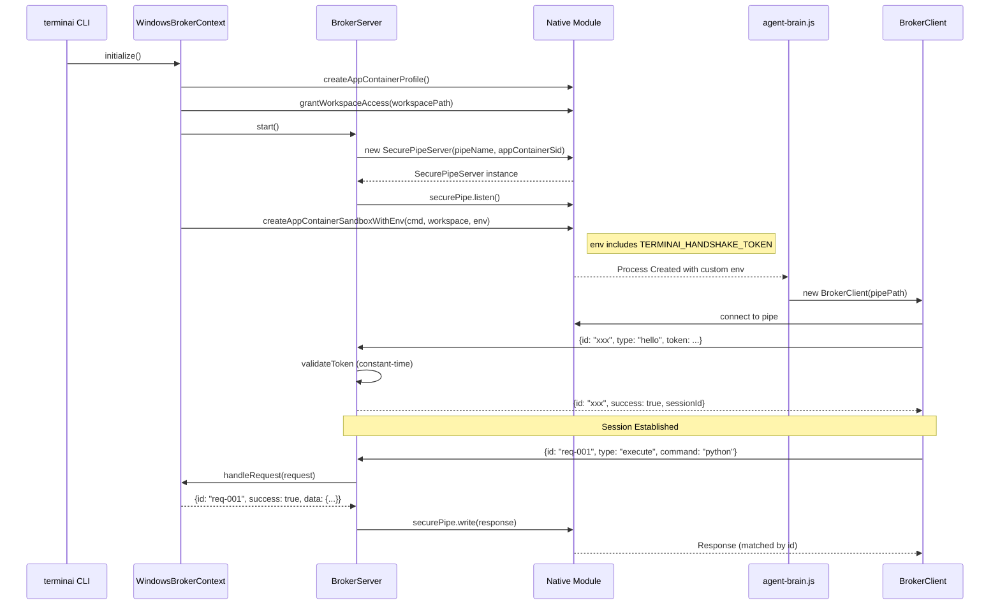

# Phase A: Infrastructure — Technical Specification

> **Status**: Draft (v1.1 — Blocker Fixes Applied)  
> **Version**: 1.1.0  
> **Date**: 2026-01-23  
> **Scope**: W1 (Launch), W2 (Secure Pipe), W3 (IPC Correctness)  
> **Companion Docs**:
>
> - [roadmap-q1-window-appcontainer.md](../roadmap-q1-window-appcontainer.md)
> - [architecture-sovereign-runtime.md](../../architecture-sovereign-runtime.md)
>   (Appendix M)

---

## 1. Executive Summary

### What

Build the foundational "Secure Tunnel" infrastructure for Windows AppContainer
execution:

- A functioning **Brain process** that the Broker can launch into an
  AppContainer sandbox
- A **Named Pipe with restricted DACL** that only the AppContainer Brain can
  connect to
- A **request-ID based IPC protocol** that correctly correlates concurrent
  requests/responses

### Why

The current Windows AppContainer tier has critical gaps:

1. `WindowsBrokerContext` spawns `agent-brain.js` which **does not exist**
2. Named Pipe ACLs are **explicitly open** (security warning in code)
3. `BrokerClient` matches responses **FIFO** (no request IDs → concurrent
   cross-wiring)

Until these are fixed, enabling the tier will immediately crash and provide no
security benefit.

### When

**Estimated Effort**: ~14 hours of focused agent implementation + ~2 hours human
validation

| Component                                 | Agent Hours | Human Hours |
| ----------------------------------------- | ----------- | ----------- |
| W1: Brain Entrypoint + Launch + Env-Block | 5h          | 1h          |
| W2: Secure Pipe (Native Server + DACL)    | 6h          | 0.5h        |
| W3: IPC Request-ID Protocol               | 3h          | 0.5h        |

### Risk

| Risk                                               | Likelihood | Impact | Mitigation                                                               |
| -------------------------------------------------- | ---------- | ------ | ------------------------------------------------------------------------ |
| Native module fails to set pipe DACL               | Medium     | High   | **Hard fail** (no fallback) — false security is worse than no security   |
| AppContainer cannot reach Node.js due to path ACLs | Medium     | High   | System `process.execPath` + doctor-driven ACL remediation (not auto-run) |
| Native env-block extension fails on older Windows  | Low        | High   | Validate Windows version, clear error message                            |

---

## 2. Architecture Overview

### 2.1 System Diagram

```mermaid
flowchart TB
    subgraph "User Layer"
        CLI[terminai CLI]
    end

    subgraph "Windows Architecture: Brain & Hands"
        subgraph "THE HANDS (Privileged Broker)"
            WBC[WindowsBrokerContext]
            BS[BrokerServer]
            NPipe[Named Pipe<br/>\\.\pipe\terminai-{sessionId}]
            Native[Native Module<br/>appcontainer_manager.cpp<br/>pipe_security.cpp]
        end

        subgraph "THE BRAIN (Sandboxed Agent)"
            Brain[agent-brain.js<br/>Headless Runtime]
            BC[BrokerClient]
        end
    end

    CLI --> WBC
    WBC --> |1. Create Profile| Native
    WBC --> |2. Start Server| BS
    BS --> |3. Create Secure Pipe| Native
    Native --> |4. Listen with DACL| NPipe
    WBC --> |5. Spawn with Env-Block| Native
    Native --> |Spawn| Brain
    Brain --> |6. Connect| BC
    BC --> |7. Hello + Token| NPipe
    NPipe <--> |8. IPC Messages| BC

    style NPipe fill:#f9f,stroke:#333,stroke-width:2px
    style Native fill:#9cf,stroke:#333
```

### 2.2 Component Responsibilities

| Component                | Responsibility                                                                          |
| ------------------------ | --------------------------------------------------------------------------------------- |
| **WindowsBrokerContext** | Orchestrates initialization: profile creation, workspace ACL, server start, brain spawn |
| **BrokerServer**         | Uses native SecurePipeServer for I/O; validates handshake; emits requests               |
| **BrokerClient**         | Named Pipe client; sends requests with IDs; matches responses by ID                     |
| **Native Module**        | C++: `createAppContainerSandboxWithEnv`, `SecurePipeServer` (DACL + I/O)                |
| **agent-brain.js**       | **Dedicated headless runtime**: connects, authenticates, runs agent loop (no UI)        |

### 2.3 Data Flow



### 2.4 External Dependencies

| Dependency                   | Purpose                     | Current State                 |
| ---------------------------- | --------------------------- | ----------------------------- |
| `node-addon-api`             | Native module bridge        | ✅ Already configured         |
| `userenv.lib`                | AppContainer profile APIs   | ✅ Linked in native module    |
| `sddl.h` / `aclapi.h`        | DACL/ACL manipulation       | ✅ Available in native module |
| `zod`                        | Schema validation           | ✅ Already in BrokerSchema.ts |
| `uuid` / `crypto.randomUUID` | Request IDs, session tokens | ✅ Node.js built-in           |

---

## 3. Technical Specification

---

### 3.1 W1: Brain Process Launch

#### 3.1.1 Purpose

Provide a real, distributable Brain entrypoint that `WindowsBrokerContext` can
spawn into the AppContainer sandbox.

#### 3.1.2 Interface

```typescript
// packages/cli/src/runtime/windows/agent-brain.ts

/**
 * Agent Brain Entrypoint for Windows AppContainer
 *
 * IMPORTANT: This is a DEDICATED HEADLESS RUNTIME, NOT a CLI wrapper.
 * It should:
 * - Connect to the broker pipe
 * - Authenticate via handshake
 * - Run the agent loop / tool scheduler
 * - Have NO UI/TTY assumptions
 */
export async function main(): Promise<void>;

// CLI entrypoint (esbuild bundle target)
// packages/cli/dist/agent-brain.js
```

```typescript
// WindowsBrokerContext spawn configuration
interface BrainSpawnConfig {
  /** Path to bundled agent-brain.js */
  brainScript: string;
  /** Named Pipe path for IPC */
  pipePath: string;
  /** Session-unique handshake token (NOT logged) */
  handshakeToken: string;
  /** Workspace directory (already ACL-granted) */
  workspacePath: string;
}
```

#### 3.1.3 Behavior

> [!IMPORTANT] **Decision (Human):** Brain is a **dedicated headless runtime
> entrypoint** — NOT a wrapper around the CLI entry. It should connect →
> authenticate → run agent loop with NO UI/TTY assumptions.

> [!WARNING] **Blocker Fix Required:** The native `createAppContainerSandbox()`
> currently passes `lpEnvironment=nullptr` to `CreateProcessW` (line 335 of
> appcontainer_manager.cpp). A new native function
> `createAppContainerSandboxWithEnv()` must be implemented that accepts a
> `Record<string, string>` and converts it to a Windows environment block
> format.

**Happy Path:**

1. `WindowsBrokerContext.initialize()` generates a cryptographic handshake token
2. Starts `BrokerServer` with native `SecurePipeServer`
3. Spawns `agent-brain.js` via **new** native
   `createAppContainerSandboxWithEnv()`, passing:
   - Command: `"${process.execPath}" "${brainPath}"`
   - Workspace path
   - Environment block with: `TERMINAI_HANDSHAKE_TOKEN`, `TERMINAI_PIPE_PATH`,
     `TERMINAI_WORKSPACE`
4. Brain process connects to pipe, sends `hello` with token
5. Server validates token, marks session as authenticated

**Edge Cases:**

- Brain fails to spawn → `initialize()` throws with native error code, cleans up
  server
- Brain spawns but fails to connect within 10s → timeout, terminate Brain, throw
- Brain sends incorrect token → reject connection, log security event, terminate
  Brain

**Error Conditions:**

- `AppContainerError.AclFailure` (-2): Workspace ACL could not be set → abort,
  clear error
- `AppContainerError.ProcessCreationFailed` (-3): CreateProcess failed → log,
  throw
- `AppContainerError.EnvBlockConversionFailed` (-6): Env block conversion failed
  → log, throw
- Brain script not found → throw `FatalRuntimeError` with clear path message

#### 3.1.4 Native Env-Block Extension

```cpp
// packages/cli/native/appcontainer_manager.cpp - NEW FUNCTION

/**
 * Create AppContainer sandbox with custom environment.
 *
 * @param commandLine Command to execute
 * @param workspacePath Workspace directory
 * @param enableInternet Enable internet capability
 * @param envObject JS object with key-value pairs for environment
 * @returns Process ID on success, negative error code on failure
 */
Napi::Value CreateAppContainerSandboxWithEnv(const Napi::CallbackInfo& info) {
    // ... validate 4 arguments ...

    // Convert JS object to Windows environment block
    // Format: KEY1=VALUE1\0KEY2=VALUE2\0\0
    std::wstring envBlock;
    Napi::Object envObj = info[3].As<Napi::Object>();
    Napi::Array keys = envObj.GetPropertyNames();
    for (uint32_t i = 0; i < keys.Length(); i++) {
        std::string key = keys.Get(i).As<Napi::String>().Utf8Value();
        std::string val = envObj.Get(key).As<Napi::String>().Utf8Value();
        envBlock += Utf8ToWide(key) + L"=" + Utf8ToWide(val) + L'\0';
    }
    envBlock += L'\0'; // Double null terminator

    // Pass to CreateProcessW lpEnvironment parameter
    CreateProcessW(
        ...,
        (LPVOID)envBlock.c_str(),  // Instead of nullptr
        ...
    );
}
```

```typescript
// packages/cli/src/runtime/windows/native.ts - NEW EXPORT
export function createAppContainerSandboxWithEnv(
  commandLine: string,
  workspacePath: string,
  enableInternet: boolean,
  env: Record<string, string>,
): number;
```

#### 3.1.5 Dependencies

- `BrokerServer` with `SecurePipeServer` (must be started first)
- **NEW** native module `createAppContainerSandboxWithEnv()`
- Bundled `agent-brain.js` in package output

#### 3.1.6 Files Affected

| File                                                       | Change                                              |
| ---------------------------------------------------------- | --------------------------------------------------- |
| `packages/cli/src/runtime/windows/agent-brain.ts`          | **[NEW]** Brain entrypoint (headless, no UI)        |
| `packages/cli/esbuild.config.mjs`                          | **[MODIFY]** Add agent-brain bundle target          |
| `packages/cli/src/runtime/windows/WindowsBrokerContext.ts` | **[MODIFY]** Use new spawn with env                 |
| `packages/cli/src/runtime/windows/BrokerSchema.ts`         | **[MODIFY]** Add `HelloRequest` schema              |
| `packages/cli/native/appcontainer_manager.cpp`             | **[MODIFY]** Add `createAppContainerSandboxWithEnv` |
| `packages/cli/src/runtime/windows/native.ts`               | **[MODIFY]** Export new native function             |

---

### 3.2 W2: Secure Named Pipe (DACL + Handshake)

#### 3.2.1 Purpose

Create a Named Pipe that **only** the specific AppContainer Brain process can
connect to, preventing command injection from other same-user processes.

#### 3.2.2 Design Decision: Native Pipe Server

> [!WARNING] **Blocker Fix:** Returning a Windows HANDLE alone is insufficient —
> Node.js `net.createServer()` cannot set `SECURITY_ATTRIBUTES` on Windows
> pipes. **Solution:** Move pipe lifecycle management INTO the native module.

**Chosen Strategy:** `SecurePipeServer` class in native code that:

1. Creates pipe with DACL (AppContainer SID + user)
2. Handles accept/read/write operations
3. Exposes async methods to JavaScript

#### 3.2.3 Interface

```cpp
// packages/cli/native/pipe_security.cpp

/**
 * SecurePipeServer - Native Named Pipe with DACL and I/O
 *
 * Since Node.js net.Server cannot set SECURITY_ATTRIBUTES on Windows pipes,
 * we implement the full server lifecycle in native code.
 */
class SecurePipeServer {
public:
    SecurePipeServer(const std::wstring& pipeName, PSID appContainerSid);
    ~SecurePipeServer();

    bool Listen();                              // Create pipe, start listening
    bool AcceptConnection(DWORD timeoutMs);     // Wait for client connection
    std::string Read();                         // Read next message (blocking)
    bool Write(const std::string& message);     // Write message to client
    void Close();                               // Close all handles

    bool IsConnected() const;
    std::wstring GetPipePath() const;

private:
    HANDLE hPipe = INVALID_HANDLE_VALUE;
    std::wstring pipeName;
    PSID appContainerSid;
    bool connected = false;

    bool CreatePipeWithDACL();
};
```

```typescript
// packages/cli/src/runtime/windows/native.ts

/**
 * Secure Named Pipe server backed by native code.
 * All I/O happens through native methods since Node.js net.Server
 * cannot set SECURITY_ATTRIBUTES on Windows pipes.
 */
export interface SecurePipeServer {
  /** Start listening on the pipe */
  listen(): boolean;

  /** Wait for client connection (returns true if connected) */
  acceptConnection(timeoutMs: number): Promise<boolean>;

  /** Read next message from connected client (null if disconnected) */
  read(): Promise<string | null>;

  /** Write message to connected client */
  write(message: string): Promise<boolean>;

  /** Close the pipe server */
  close(): void;

  /** Check if client is connected */
  isConnected(): boolean;

  /** Get the pipe path */
  readonly pipePath: string;
}

export function createSecurePipeServer(
  pipeName: string,
  appContainerSid: string,
): SecurePipeServer;
```

```typescript
// BrokerSchema.ts - Hello request for authentication
export const HelloRequestSchema = z.object({
  type: z.literal('hello'),
  /** Session handshake token (secret, not logged) */
  token: z.string().min(32).max(256),
  /** Client-reported process ID for verification */
  pid: z.number().int().positive().optional(),
});

export const HelloResponseSchema = z.object({
  id: z.string().uuid(),
  success: z.literal(true),
  sessionId: z.string(),
  /** Server timestamp for clock sync */
  timestamp: z.number(),
});
```

#### 3.2.4 Behavior

**DACL Construction (in native):**

```cpp
bool SecurePipeServer::CreatePipeWithDACL() {
    // Build DACL with two entries
    EXPLICIT_ACCESS_W ea[2] = {};

    // Entry 1: Grant AppContainer SID pipe access
    ea[0].grfAccessPermissions = FILE_GENERIC_READ | FILE_GENERIC_WRITE;
    ea[0].grfAccessMode = SET_ACCESS;
    ea[0].grfInheritance = NO_INHERITANCE;
    ea[0].Trustee.TrusteeForm = TRUSTEE_IS_SID;
    ea[0].Trustee.ptstrName = (LPWSTR)appContainerSid;

    // Entry 2: Grant current user full access (for server)
    HANDLE token;
    OpenProcessToken(GetCurrentProcess(), TOKEN_QUERY, &token);
    // ... get user SID from token ...
    ea[1].grfAccessPermissions = FILE_ALL_ACCESS;
    ea[1].grfAccessMode = SET_ACCESS;
    ea[1].grfInheritance = NO_INHERITANCE;
    ea[1].Trustee.TrusteeForm = TRUSTEE_IS_SID;
    ea[1].Trustee.ptstrName = (LPWSTR)userSid;

    // Create DACL
    PACL pAcl = nullptr;
    SetEntriesInAclW(2, ea, NULL, &pAcl);

    // Create security descriptor
    PSECURITY_DESCRIPTOR pSD = LocalAlloc(LPTR, SECURITY_DESCRIPTOR_MIN_LENGTH);
    InitializeSecurityDescriptor(pSD, SECURITY_DESCRIPTOR_REVISION);
    SetSecurityDescriptorDacl(pSD, TRUE, pAcl, FALSE);

    SECURITY_ATTRIBUTES sa = { sizeof(sa), pSD, FALSE };

    // Create pipe with security attributes
    hPipe = CreateNamedPipeW(
        pipeName.c_str(),
        PIPE_ACCESS_DUPLEX | FILE_FLAG_OVERLAPPED,
        PIPE_TYPE_MESSAGE | PIPE_READMODE_MESSAGE | PIPE_WAIT,
        1,      // Max instances
        65536,  // Out buffer
        65536,  // In buffer
        0,      // Default timeout
        &sa
    );

    LocalFree(pAcl);
    LocalFree(pSD);

    return hPipe != INVALID_HANDLE_VALUE;
}
```

> [!CAUTION] **Decision (Human):** If DACL creation fails, **hard fail** — do
> NOT proceed with an open pipe. False security is worse than no security. For
> dev convenience only: gate behind explicit `TERMINAI_UNSAFE_OPEN_PIPE=true`
> flag.

**Handshake Flow:**

1. Server generates 64-byte random token:
   `crypto.randomBytes(64).toString('hex')`
2. Token passed to Brain via `TERMINAI_HANDSHAKE_TOKEN` environment variable
3. Brain's first message MUST be `{type: "hello", token: "..."}`
4. Server validates token matches (constant-time comparison via
   `crypto.timingSafeEqual`)
5. On match: session authenticated, subsequent requests processed
6. On mismatch: close pipe, log security event, terminate Brain

**Edge Cases:**

- Client sends non-hello as first message → reject, close
- Token timing attack → use `crypto.timingSafeEqual()` for comparison
- Multiple hello attempts → reject after first (replay prevention)
- DACL creation fails → **throw error, do not proceed**

#### 3.2.5 Dependencies

- Native module with `SecurePipeServer` class
- `crypto` module for token generation and comparison

#### 3.2.6 Files Affected

| File                                                       | Change                                                  |
| ---------------------------------------------------------- | ------------------------------------------------------- |
| `packages/cli/native/pipe_security.cpp`                    | **[NEW]** SecurePipeServer class with DACL and I/O      |
| `packages/cli/native/pipe_security.h`                      | **[NEW]** Header file                                   |
| `packages/cli/native/binding.gyp`                          | **[MODIFY]** Add pipe_security.cpp                      |
| `packages/cli/src/runtime/windows/native.ts`               | **[MODIFY]** Export SecurePipeServer interface          |
| `packages/cli/src/runtime/windows/BrokerServer.ts`         | **[MODIFY]** Use SecurePipeServer instead of net.Server |
| `packages/cli/src/runtime/windows/BrokerSchema.ts`         | **[MODIFY]** Add HelloRequest/HelloResponse schemas     |
| `packages/cli/src/runtime/windows/WindowsBrokerContext.ts` | **[MODIFY]** Generate token, pass to Brain              |

---

### 3.3 W3: IPC Request-ID Protocol

#### 3.3.1 Purpose

Enable correct concurrent request/response matching by adding unique IDs to each
message. The current FIFO matching will cross-wire responses when multiple tools
execute in parallel.

#### 3.3.2 Interface

```typescript
// BrokerSchema.ts - Updated request base
export const BaseRequestSchema = z.object({
  /** Unique request identifier (UUID v4) */
  id: z.string().uuid(),
});

export const ExecuteRequestSchema = BaseRequestSchema.extend({
  type: z.literal('execute'),
  command: z.string().min(1),
  args: z.array(z.string()).optional(),
  cwd: z.string().optional(),
  env: z.record(z.string()).optional(),
  timeout: z.number().positive().optional(),
});

// ... other request schemas extend BaseRequestSchema

// Response schemas include id echo
export const SuccessResponseSchema = z.object({
  /** Echo of request id */
  id: z.string().uuid(),
  success: z.literal(true),
  data: z.unknown().optional(),
});

export const ErrorResponseSchema = z.object({
  /** Echo of request id */
  id: z.string().uuid(),
  success: z.literal(false),
  error: z.string(),
  code: z.string().optional(),
});
```

```typescript
// BrokerClient.ts - Request tracking
interface PendingRequest {
  id: string;
  resolve: (response: BrokerResponse) => void;
  reject: (error: Error) => void;
  timeout: NodeJS.Timeout;
  startTime: number;
}

class BrokerClient {
  private pendingRequests: Map<string, PendingRequest> = new Map();

  async sendRequest(
    request: Omit<BrokerRequest, 'id'>,
  ): Promise<BrokerResponse> {
    const id = crypto.randomUUID();
    const fullRequest = { id, ...request };
    // ... send and track by id
  }

  private handleData(data: Buffer): void {
    // Parse response, extract id, resolve matching pending request
  }
}
```

#### 3.3.3 Behavior

**Request Flow:**

1. Client generates UUID for each request
2. Client stores `{ resolve, reject, timeout }` in `pendingRequests.get(id)`
3. Client sends JSON message with `id` field
4. Server processes request, echoes `id` in response
5. Client receives response, looks up `pendingRequests.get(response.id)`
6. Client resolves/rejects the correct promise, clears timeout, removes from map

**Timeout Handling:**

```typescript
const pending: PendingRequest = {
  id,
  resolve,
  reject,
  startTime: Date.now(),
  timeout: setTimeout(() => {
    this.pendingRequests.delete(id);
    reject(new Error(`Request ${id} timed out after ${this.requestTimeout}ms`));
  }, this.requestTimeout),
};
```

**Edge Cases:**

- Response for unknown ID → log warning, ignore (stale/replay)
- Request timeout → reject promise, remove from map, log
- Connection lost with pending requests → reject all pending with connection
  error
- Duplicate request ID (extremely unlikely with UUID) → reject second

#### 3.3.4 Dependencies

- `crypto.randomUUID()` (Node.js 16+)
- Updated Zod schemas

#### 3.3.5 Files Affected

| File                                               | Change                                                   |
| -------------------------------------------------- | -------------------------------------------------------- |
| `packages/cli/src/runtime/windows/BrokerSchema.ts` | **[MODIFY]** Add `id` to all requests/responses          |
| `packages/cli/src/runtime/windows/BrokerClient.ts` | **[MODIFY]** Request tracking by ID, timeout per-request |
| `packages/cli/src/runtime/windows/BrokerServer.ts` | **[MODIFY]** Echo `id` in all responses                  |

---

## 4. Data Models

```typescript
// ============================================================================
// Session State
// ============================================================================

interface BrokerSession {
  /** Unique session identifier */
  sessionId: string;
  /** AppContainer SID string for this session */
  appContainerSid: string;
  /** Handshake token (stored for validation, never logged) */
  handshakeToken: string;
  /** Whether the handshake has been completed */
  authenticated: boolean;
  /** Brain process ID */
  brainPid: number | null;
  /** Session start timestamp */
  startedAt: Date;
  /** Workspace path for this session */
  workspacePath: string;
}

// ============================================================================
// Enhanced Request/Response (W3)
// ============================================================================

/** Base fields for all requests */
interface BaseRequest {
  /** Unique request ID (UUID v4) */
  id: string;
}

/** Base fields for all responses */
interface BaseResponse {
  /** Echo of request ID */
  id: string;
  /** Whether the operation succeeded */
  success: boolean;
}

// ============================================================================
// Hello Handshake (W2)
// ============================================================================

interface HelloRequest extends BaseRequest {
  type: 'hello';
  /** Session handshake token */
  token: string;
  /** Optional: client PID for verification */
  pid?: number;
}

interface HelloResponse extends BaseResponse {
  success: true;
  /** Session ID assigned by server */
  sessionId: string;
  /** Server timestamp for clock synchronization */
  timestamp: number;
}

// ============================================================================
// Error Codes
// ============================================================================

enum BrokerErrorCode {
  // Authentication errors
  INVALID_TOKEN = 'INVALID_TOKEN',
  SESSION_NOT_AUTHENTICATED = 'SESSION_NOT_AUTHENTICATED',
  HANDSHAKE_REQUIRED = 'HANDSHAKE_REQUIRED',

  // Request errors
  INVALID_REQUEST = 'INVALID_REQUEST',
  REQUEST_TIMEOUT = 'REQUEST_TIMEOUT',
  UNKNOWN_REQUEST_TYPE = 'UNKNOWN_REQUEST_TYPE',

  // Execution errors
  COMMAND_NOT_ALLOWED = 'COMMAND_NOT_ALLOWED',
  PATH_OUTSIDE_WORKSPACE = 'PATH_OUTSIDE_WORKSPACE',
  AMSI_BLOCKED = 'AMSI_BLOCKED',
  EXECUTION_FAILED = 'EXECUTION_FAILED',

  // Internal errors
  NATIVE_MODULE_ERROR = 'NATIVE_MODULE_ERROR',
  PIPE_DACL_FAILED = 'PIPE_DACL_FAILED',
  ENV_BLOCK_FAILED = 'ENV_BLOCK_FAILED',
  INTERNAL_ERROR = 'INTERNAL_ERROR',
}
```

---

## 5. Security Considerations

### 5.1 Authentication & Authorization

| Control              | Implementation                                   | Notes                            |
| -------------------- | ------------------------------------------------ | -------------------------------- |
| **Pipe DACL**        | Native DACL restricts to AppContainer SID + user | Prevents other-process injection |
| **Handshake Token**  | 64-byte cryptographic random                     | Prevents token guessing          |
| **Token Delivery**   | Environment variable, not CLI args               | Args visible in process list     |
| **Token Validation** | Constant-time comparison                         | Prevents timing attacks          |
| **Session Binding**  | One Brain per session                            | No connection sharing            |
| **DACL Failure**     | **Hard fail** (no open pipe fallback)            | False security worse than none   |

### 5.2 Data Validation

| Layer                 | Validation                       | Tool                                  |
| --------------------- | -------------------------------- | ------------------------------------- |
| **Wire Protocol**     | JSON parsing                     | Native JSON.parse                     |
| **Schema**            | Zod discriminated unions         | BrokerRequestSchema                   |
| **Path Traversal**    | Canonical path containment check | `WindowsBrokerContext.validatePath()` |
| **Command Filtering** | Allowlist + approval ladder      | Existing policy engine                |

### 5.3 Sensitive Data Handling

| Data             | Protection                                        |
| ---------------- | ------------------------------------------------- |
| Handshake Token  | Never logged, redacted from telemetry             |
| Pipe Path        | Session-specific, includes random session ID      |
| Request Contents | May contain secrets → audit redaction rules apply |

> [!WARNING] The handshake token MUST be passed via `TERMINAI_HANDSHAKE_TOKEN`
> environment variable, NOT via command-line arguments. Command-line arguments
> are visible to other processes via `ProcessExplorer`, `wmic`, etc.

---

## 6. Testing Strategy

### 6.1 Unit Tests

| Component                | Test Cases                                                                           |
| ------------------------ | ------------------------------------------------------------------------------------ |
| **BrokerSchema**         | Valid/invalid request parsing, ID validation, hello schema                           |
| **BrokerClient**         | Request ID generation, pending request tracking, timeout handling, response matching |
| **BrokerServer**         | Hello validation, token comparison, authentication state                             |
| **WindowsBrokerContext** | Path validation, error code mapping                                                  |

**Test Commands:**

```bash
npm run test -- packages/cli/src/runtime/windows/*.test.ts
```

### 6.2 Integration Tests

| Test                    | Description                                                 |
| ----------------------- | ----------------------------------------------------------- |
| **Ping-Pong**           | Start server, spawn brain, verify hello + ping works        |
| **Concurrent Requests** | Send 10 parallel requests, verify correct response matching |
| **Timeout**             | Send request to slow handler, verify per-request timeout    |
| **Invalid Token**       | Spawn process with wrong token, verify rejection            |
| **DACL Enforcement**    | From separate process, attempt pipe connect, verify denied  |

> [!NOTE] Integration tests require Windows environment. Use
> `process.platform === 'win32'` guards or mark as `.skip` on other platforms.

### 6.3 Manual Verification

| Step                                                 | Expected Result                    | Who   |
| ---------------------------------------------------- | ---------------------------------- | ----- |
| 1. Run `terminai doctor --windows-appcontainer`      | All checks pass                    | Human |
| 2. From separate PowerShell, attempt pipe connection | Connection refused (DACL)          | Human |
| 3. Execute shell tool with AppContainer enabled      | Command runs, output correct       | Human |
| 4. Run two parallel tool calls                       | Correct responses returned to each | Agent |

---

## 7. Migration / Rollout Plan

### 7.1 Backward Compatibility

| Change                | Compatibility              | Notes                                      |
| --------------------- | -------------------------- | ------------------------------------------ |
| Add `id` to requests  | Breaking for raw IPC users | All IPC is internal; no external consumers |
| Add `hello` handshake | Breaking                   | Old clients won't send hello → rejected    |
| Secure pipe DACL      | Transparent                | Only affects connection permissions        |
| Env-block spawn       | Transparent                | Same API, more capability                  |

> [!IMPORTANT] This is an internal IPC protocol with no external consumers.
> Breaking changes are acceptable as long as `BrokerClient` and `BrokerServer`
> are updated together.

### 7.2 Feature Flags

- `TERMINAI_WINDOWS_APPCONTAINER=true` — explicitly enable tier (existing)
- `TERMINAI_UNSAFE_OPEN_PIPE=true` — **dev only**: skip DACL (not for
  production)
- No other new flags required for Phase A

### 7.3 Rollback Procedure

If Phase A causes issues:

1. Disable via `TERMINAI_WINDOWS_APPCONTAINER=false`
2. Falls back to Managed Local Runtime (Tier 2)
3. No data migration required — sessions are ephemeral

---

## 8. Resolved Decisions

| #   | Question               | Decision                                         | Rationale                                                                                   |
| --- | ---------------------- | ------------------------------------------------ | ------------------------------------------------------------------------------------------- |
| 1   | **Brain architecture** | **Dedicated headless runtime entrypoint**        | Wrapping CLI entry drags in TTY/UI concerns; Brain should be minimal: connect → auth → loop |
| 2   | **Node.js bundling**   | **System Node via `process.execPath`**           | ACL grant is doctor-driven remediation (not auto-run). Long-term: consider SEA/packaged exe |
| 3   | **Hello timeout**      | **10 seconds** (via `TERMINAI_HELLO_TIMEOUT_MS`) | Reasonable default for cold start; configurable                                             |
| 4   | **Pipe DACL fallback** | **Hard fail by default**                         | False security is worse. Dev: gate behind `TERMINAI_UNSAFE_OPEN_PIPE=true`                  |

---

## Summary (5-7 Bullet Points)

1. **W1 (Launch)**: Create `agent-brain.ts` as a **headless runtime** (no UI),
   extend native module with `createAppContainerSandboxWithEnv()` to pass
   handshake token via environment
2. **W2 (Secure Pipe)**: Implement native `SecurePipeServer` class that handles
   full pipe lifecycle with DACL restricting access to AppContainer SID; **hard
   fail** if DACL cannot be applied
3. **W3 (IPC Correctness)**: Add UUID `id` field to all requests/responses,
   track pending requests by ID in `BrokerClient`, implement per-request
   timeouts
4. **Blocker Fixes**: Extended native API for env-block, moved pipe I/O to
   native to enable SECURITY_ATTRIBUTES
5. **Security**: Token via env var, constant-time comparison, DACL prevents
   injection, hard fail on DACL error
6. **Testing**: Unit tests for schemas/client/server, integration tests for full
   flow (Windows-only), manual DACL verification by human
7. **Rollout**: Internal protocol only, disable via env flag for rollback
