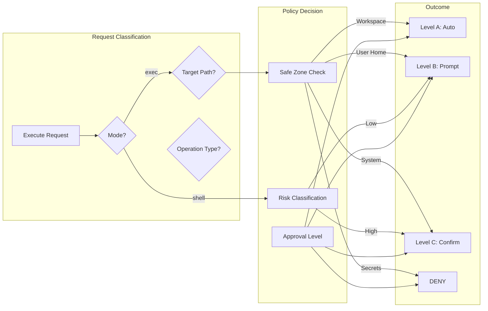
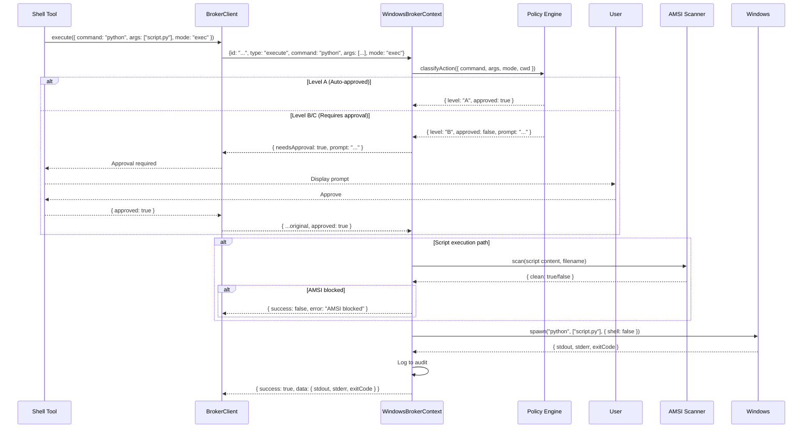
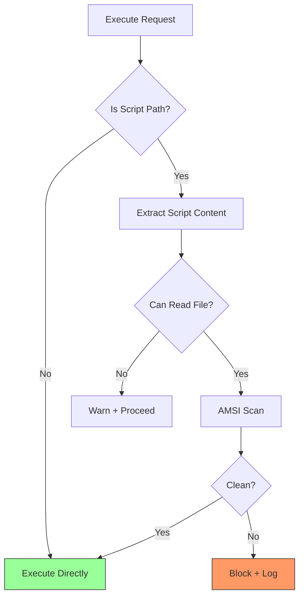

# Phase B: Capability — Technical Specification

> **Status**: Draft (v1.0)  
> **Version**: 1.0.0  
> **Date**: 2026-01-23  
> **Scope**: W4 (Execute/Spawn), W5 (Policy & AMSI)  
> **Companion Docs**:
>
> - [roadmap-q1-window-appcontainer.md](../roadmap-q1-window-appcontainer.md)
> - [phase-a-infrastructure-spec.md](./phase-a-infrastructure-spec.md)
> - [architecture-sovereign-runtime.md](../../architecture-sovereign-runtime.md)

---

## 1. Executive Summary

### What

Restore "Agent Power" safely over the Phase A secure tunnel by:

- Implementing a **structured `execute()` contract** (shell vs exec mode) that
  eliminates the `ALLOWED_COMMANDS` allowlist trap
- Integrating with the **Policy Engine** for approval-based capability rather
  than hardcoded restrictions
- Enforcing **AMSI scanning** for all script-like execution paths

### Why

The current `WindowsBrokerContext` implementation has a critical limitation:

```typescript
private static readonly ALLOWED_COMMANDS = [
  'echo', 'dir', 'cd', 'python', 'python3', 'pip', 'node', 'npm', 'npx',
  'git', 'powershell', 'pwsh', 'cmd', 'net', 'ipconfig', 'whoami',
];
```

This hardcoded allowlist creates an **"expand forever" trap** — every new
legitimate use case requires adding commands, eventually undermining security.
The roadmap explicitly calls this out:

> "The system does not devolve into 'expand ALLOWED_COMMANDS forever'. Risky
> operations are handled by approvals (B/C) and audit, not by brittle
> hardcoding." — W5

### When

**Estimated Effort**: ~16 hours of focused agent implementation + ~2 hours human
validation

| Component                       | Agent Hours | Human Hours |
| ------------------------------- | ----------- | ----------- |
| W4: Structured Execute Contract | 6h          | 0.5h        |
| W4: IPC Schema Updates          | 2h          | —           |
| W5: Policy Engine Integration   | 4h          | 1h          |
| W5: AMSI Enforcement Expansion  | 3h          | 0.5h        |
| Integration Testing             | 1h          | —           |

### Risk

| Risk                                                  | Likelihood | Impact   | Mitigation                                                                             |
| ----------------------------------------------------- | ---------- | -------- | -------------------------------------------------------------------------------------- |
| Over-permissive policy allows dangerous commands      | Medium     | High     | Default-deny with explicit approval escalation; hard stops for catastrophic operations |
| Approval bypass via malicious Brain                   | Medium     | Critical | **Approvals happen in Hands only**; Brain cannot bypass policy                         |
| AMSI unavailable leaves malware gate open             | Medium     | High     | **Block script execution by default** when AMSI unavailable                            |
| Structured exec breaks compatibility with shell tools | Medium     | Medium   | Provide explicit `shell` mode with **Level C** approval requirement                    |

---

## 2. Architecture Overview

### 2.1 System Diagram — Capability Layer

```mermaid
flowchart TB
    subgraph "Brain (Sandboxed Agent)"
        Tool[Shell Tool / REPL Tool]
        BC[BrokerClient]
    end

    subgraph "Hands (Privileged Broker)"
        WBC[WindowsBrokerContext]
        PE[Policy Engine]
        AMSI[AMSI Scanner]
        Exec[Executor]
        Audit[Audit Ledger]
    end

    Tool -->|1. execute(command, mode)| BC
    BC -->|2. IPC Request| WBC
    WBC -->|3. Classify| PE
    PE -->|4a. Level A: Auto-approve| Exec
    PE -->|4b. Level B/C: Prompt| User((User))
    User -->|5. Approve/Deny| PE
    PE -->|6. Script path?| AMSI
    AMSI -->|7. Clean/Blocked| Exec
    Exec -->|8. spawn(cmd, args)| OS[Windows Process]
    Exec -->|9. Result| WBC
    WBC -->|10. Log| Audit
    WBC -->|11. Response| BC

    style PE fill:#9cf,stroke:#333,stroke-width:2px
    style AMSI fill:#f9f,stroke:#333,stroke-width:2px
```

### 2.2 The Structured Execution Contract

**Core Insight**: The problem isn't _which_ commands are allowed, but _how_ they
are invoked. We distinguish:

| Mode        | Description                                | Risk Level              | Approval Required    |
| ----------- | ------------------------------------------ | ----------------------- | -------------------- |
| **`exec`**  | Direct executable with args array          | Lower                   | Policy-based (A/B/C) |
| **`shell`** | Command string passed to shell interpreter | Higher (injection risk) | **Level C minimum**  |

**The `exec` mode** uses `spawn(command, args, { shell: false })`:

- No shell metacharacter interpretation
- Arguments are passed directly to the process
- Injection attacks require controlling the executable path itself

**The `shell` mode** uses `spawn(command, { shell: true })` or explicit
`cmd.exe /c`:

- Shell expansion, pipes, redirects work
- Higher risk of injection via metacharacters
- Required for complex shell operations (pipelines, globbing)

### 2.3 Policy Engine Integration Architecture



### 2.4 Data Flow — Complete Execution Path



---

## 3. Technical Specification

---

### 3.1 W4: Structured Execute Contract

#### 3.1.1 Purpose

Replace the brittle `ALLOWED_COMMANDS` allowlist with a structured execution
contract that:

1. Separates `exec` mode (safe) from `shell` mode (risky)
2. Delegates security decisions to the Policy Engine
3. Provides deterministic behavior for tools (no surprising rejections)

#### 3.1.2 Interface — Updated BrokerSchema

```typescript
// packages/cli/src/runtime/windows/BrokerSchema.ts

/**
 * Execution mode for the execute request.
 *
 * - 'exec': Direct executable invocation (shell: false)
 *   - Arguments passed as array, no shell interpretation
 *   - Lower risk, policy applies standard classification
 *
 * - 'shell': Shell command execution (cmd.exe /c or powershell)
 *   - Command string interpreted by shell
 *   - Higher risk, policy applies elevated scrutiny
 */
export const ExecutionModeSchema = z.enum(['exec', 'shell']);
export type ExecutionMode = z.infer<typeof ExecutionModeSchema>;

/**
 * Enhanced execute request with mode discrimination and approval flow.
 */
export const ExecuteRequestSchema = BaseRequestSchema.extend({
  type: z.literal('execute'),

  /** Command/executable to run */
  command: z.string().min(1),

  /**
   * Arguments array (only used in 'exec' mode).
   * In 'shell' mode, the command string includes all arguments.
   */
  args: z.array(z.string()).optional(),

  /** Working directory (must be within workspace unless elevated) */
  cwd: z.string().optional(),

  /** Environment variables to add/override */
  env: z.record(z.string()).optional(),

  /** Timeout in milliseconds (default: 30000) */
  timeout: z.number().positive().optional(),

  /**
   * Execution mode: 'exec' (direct) or 'shell' (interpreted).
   * Default: 'exec' for safety. Shell mode requires Level C approval.
   */
  mode: ExecutionModeSchema.optional().default('exec'),

  // NOTE: No 'preApproved' field. Approvals happen entirely in Hands.
  // Brain cannot bypass policy by claiming pre-approval.
});
```

#### 3.1.3 Interface — Policy Classification Types

```typescript
// packages/cli/src/runtime/windows/PolicyTypes.ts

/** Action classification from Policy Engine */
export interface ActionClassification {
  /** Approval level required: A (auto), B (prompt), C (confirm), or DENY */
  level: 'A' | 'B' | 'C' | 'DENY';

  /** Human-readable reason for classification */
  reason: string;

  /** Whether action is pre-approved (level A or previously approved) */
  approved: boolean;

  /** Prompt to show user for B/C level (undefined for A/DENY) */
  prompt?: string;

  /** Risk factors that contributed to classification */
  riskFactors: RiskFactor[];
}

export interface RiskFactor {
  factor: string;
  severity: 'low' | 'medium' | 'high' | 'critical';
  description: string;
}

/** Input for policy classification */
export interface ActionContext {
  command: string;
  args?: string[];
  mode: 'exec' | 'shell';
  cwd: string;
  targetPaths?: string[];
  isScriptExecution?: boolean;
  scriptContent?: string;
}
```

#### 3.1.4 Behavior — handleExecute (Updated)

```typescript
// WindowsBrokerContext.ts — handleExecute (REPLACEMENT)

/**
 * Handle 'execute' request with Hands-side approval flow.
 *
 * SECURITY: Approvals happen ENTIRELY in Hands. Brain cannot bypass policy.
 * If Level B/C is required, Hands prompts the user directly before executing.
 */
private async handleExecute(
  request: Extract<BrokerRequest, { type: 'execute' }>,
  respond: (response: BrokerResponse) => void,
): Promise<void> {
  const mode = request.mode ?? 'exec';
  const cwd = request.cwd ?? this.workspacePath;
  const timeout = request.timeout ?? 30000;

  // 1. Canonicalize path (resolve symlinks, junctions, normalize)
  let canonicalCwd: string;
  try {
    canonicalCwd = await this.canonicalizePath(cwd);
  } catch (error) {
    respond(createErrorResponse((error as Error).message, 'PATH_INVALID'));
    return;
  }

  // 2. Classify zone and authorize
  const zone = this.classifyZone(canonicalCwd);
  const targetPaths = await this.canonicalizeTargetPaths(request.command, request.args);

  // 3. Build action context for policy classification
  const actionContext: ActionContext = {
    command: request.command,
    args: request.args,
    mode,
    cwd: canonicalCwd,
    zone,
    targetPaths,
  };

  // 4. Classify action via Policy Engine
  const classification = await this.policyEngine.classifyAction(actionContext);

  // 5. Handle DENY (hard stops — cannot be bypassed)
  if (classification.level === 'DENY') {
    respond(createErrorResponse(
      `Action denied: ${classification.reason}`,
      'POLICY_DENIED'
    ));
    await this.audit.log({
      type: 'execute_denied',
      command: request.command,
      reason: classification.reason,
      riskFactors: classification.riskFactors,
    });
    return;
  }

  // 6. Handle approval flow (B/C levels) — APPROVAL HAPPENS IN HANDS
  if (classification.level !== 'A') {
    const approved = await this.promptUserApproval({
      level: classification.level,
      command: request.command,
      args: request.args,
      mode,
      prompt: classification.prompt!,
      riskFactors: classification.riskFactors,
    });

    if (!approved) {
      respond(createErrorResponse('User denied execution', 'USER_DENIED'));
      await this.audit.log({
        type: 'execute_denied',
        command: request.command,
        reason: 'User denied',
        level: classification.level,
      });
      return;
    }
  }

  // 7. AMSI scan for script-like paths — BLOCK if AMSI unavailable
  if (this.isScriptPath(request.command, request.args)) {
    const amsiResult = await this.scanScriptWithAmsi(request.command, request.args);
    if (amsiResult.blocked) {
      respond(createErrorResponse(amsiResult.reason, amsiResult.code));
      return;
    }
  }

  // 8. Execute based on mode
  if (mode === 'exec') {
    await this.executeExecMode(request, canonicalCwd, timeout, respond);
  } else {
    await this.executeShellMode(request, canonicalCwd, timeout, respond);
  }

  // 9. Audit log
  await this.audit.log({
    type: 'execute',
    command: request.command,
    mode,
    classification: classification.level,
    zone,
  });
}
```

#### 3.1.5 Behavior — Exec Mode vs Shell Mode

```typescript
/**
 * Execute in 'exec' mode: direct process spawn, no shell.
 */
private async executeExecMode(
  request: ExecuteRequest,
  cwd: string,
  timeout: number,
  respond: (response: BrokerResponse) => void,
): Promise<void> {
  const { spawn } = await import('node:child_process');

  return new Promise((resolve) => {
    const proc = spawn(request.command, request.args ?? [], {
      cwd,
      env: { ...process.env, ...request.env },
      timeout,
      shell: false, // CRITICAL: No shell interpretation
    });

    // ... stdout/stderr collection, timeout handling (same as current)
  });
}

/**
 * Execute in 'shell' mode: command passed to shell interpreter.
 * ELEVATED RISK: Shell metacharacters are interpreted.
 */
private async executeShellMode(
  request: ExecuteRequest,
  cwd: string,
  timeout: number,
  respond: (response: BrokerResponse) => void,
): Promise<void> {
  const { spawn } = await import('node:child_process');

  // Build full command string
  const fullCommand = request.args?.length
    ? `${request.command} ${request.args.join(' ')}`
    : request.command;

  return new Promise((resolve) => {
    const proc = spawn(fullCommand, [], {
      cwd,
      env: { ...process.env, ...request.env },
      timeout,
      shell: true, // Shell interpretation enabled
    });

    // ... stdout/stderr collection, timeout handling
  });
}
```

#### 3.1.6 Files Affected (W4)

| File                                                       | Change                                                 |
| ---------------------------------------------------------- | ------------------------------------------------------ |
| `packages/cli/src/runtime/windows/BrokerSchema.ts`         | **[MODIFY]** Add `mode`, `preApproved` fields          |
| `packages/cli/src/runtime/windows/PolicyTypes.ts`          | **[NEW]** Policy classification types                  |
| `packages/cli/src/runtime/windows/WindowsBrokerContext.ts` | **[MODIFY]** Replace ALLOWED_COMMANDS with policy flow |
| `packages/cli/src/runtime/windows/BrokerClient.ts`         | **[MODIFY]** Support approval flow in sendRequest      |

---

### 3.2 W5: Policy Engine Integration

#### 3.2.1 Purpose

Replace the static allowlist with dynamic, policy-driven capability:

- **Safe Zones** define default permissions by path category
- **Risk Classification** elevates scrutiny for dangerous operations
- **Hard Stops** prevent catastrophic operations even with C-level approval

#### 3.2.2 Interface — BrokerPolicyEngine

```typescript
// packages/cli/src/runtime/windows/BrokerPolicyEngine.ts

import {
  ActionContext,
  ActionClassification,
  RiskFactor,
} from './PolicyTypes.js';

/**
 * BrokerPolicyEngine provides policy-based command authorization.
 *
 * This replaces the ALLOWED_COMMANDS allowlist with a flexible,
 * approval-ladder-integrated policy system.
 */
export class BrokerPolicyEngine {
  private readonly workspacePath: string;
  private readonly safeZones: SafeZoneConfig;
  private readonly hardStops: HardStopConfig;

  constructor(config: BrokerPolicyEngineConfig) {
    this.workspacePath = config.workspacePath;
    this.safeZones = config.safeZones ?? DEFAULT_SAFE_ZONES;
    this.hardStops = config.hardStops ?? DEFAULT_HARD_STOPS;
  }

  /**
   * Classify an action and determine required approval level.
   */
  async classifyAction(context: ActionContext): Promise<ActionClassification> {
    const riskFactors: RiskFactor[] = [];

    // 1. Check hard stops (DENY regardless of approval)
    const hardStop = this.checkHardStops(context);
    if (hardStop) {
      return {
        level: 'DENY',
        reason: hardStop.reason,
        approved: false,
        riskFactors: [hardStop],
      };
    }

    // 2. Classify by execution mode
    if (context.mode === 'shell') {
      riskFactors.push({
        factor: 'shell_mode',
        severity: 'medium',
        description: 'Shell mode enables metacharacter interpretation',
      });
    }

    // 3. Classify by target paths (Safe Zones)
    const zoneClassification = this.classifyByZone(context);
    riskFactors.push(...zoneClassification.factors);

    // 4. Classify by command risk
    const commandRisk = this.classifyCommand(context.command);
    riskFactors.push(...commandRisk.factors);

    // 5. Determine final level
    const level = this.computeLevel(riskFactors, zoneClassification.baseLevel);

    return {
      level,
      reason: this.formatReason(riskFactors),
      approved: level === 'A',
      prompt:
        level !== 'A'
          ? this.formatPrompt(context, level, riskFactors)
          : undefined,
      riskFactors,
    };
  }

  // ... private helper methods
}
```

#### 3.2.3 Safe Zone Configuration

```typescript
// Default Safe Zones — refined for security
const DEFAULT_SAFE_ZONES: SafeZoneConfig = {
  workspace: {
    // Current project directory — full access
    read: 'A',
    write: 'A',
    execute: 'A',
  },
  userHome: {
    // ~/Documents, ~/Downloads — write requires prompt
    read: 'A',
    write: 'B',
    delete: 'C',
  },
  config: {
    // ~/.config, ~/.terminai — agent config is safe
    read: 'A',
    write: 'A',
    execute: 'B',
  },
  system: {
    // C:\Windows, C:\Program Files, /etc, /usr — high scrutiny
    read: 'B',
    write: 'C', // Changed from DENY: allow with explicit confirm
    execute: 'C',
  },
  secrets: {
    // ~/.ssh, ~/.gnupg, ~/.aws — DENY by default, allowlist if needed
    read: 'DENY', // Changed from C: no silent key exfil
    write: 'DENY',
    delete: 'DENY',
  },
};
```

#### 3.2.4 Hard Stops Configuration

```typescript
/**
 * Hard stops: MINIMAL list of truly irreversible/catastrophic operations.
 * Even C-level approval cannot override these.
 *
 * Principle: Only operations that cause unrecoverable damage belong here.
 * Most "scary" operations should be C + explicit prompt, not DENY.
 */
const DEFAULT_HARD_STOPS: HardStopConfig = {
  patterns: [
    // Disk wipe / partition (irreversible data loss)
    { pattern: /^diskpart/i, reason: 'Disk partitioning — irreversible' },
    { pattern: /^format\s+[a-zA-Z]:/i, reason: 'Format drive — irreversible' },
    {
      pattern: /\bdd\b.*\bof=\/dev\//i,
      reason: 'Raw disk write — irreversible',
    },

    // Shadow deletion (breaks recovery)
    {
      pattern: /vssadmin.*delete.*shadows/i,
      reason: 'VSS shadow deletion — breaks recovery',
    },

    // Boot configuration (can brick system)
    {
      pattern: /^bcdedit/i,
      reason: 'Boot config modification — can brick system',
    },

    // Known credential theft tools
    { pattern: /\bmimikatz\b/i, reason: 'Credential theft tool' },
    { pattern: /\blazagne\b/i, reason: 'Password extraction tool' },
    { pattern: /\bsekurlsa\b/i, reason: 'Credential dumping' },
  ],

  paths: [
    // Boot/recovery critical
    {
      path: 'C:\\Windows\\System32\\config\\SAM',
      operation: 'any',
      reason: 'Security Account Manager',
    },
    {
      path: 'C:\\Windows\\System32\\config\\SYSTEM',
      operation: 'any',
      reason: 'System registry hive',
    },
    { path: '/etc/shadow', operation: 'any', reason: 'Password hashes' },
  ],

  // NOTE: Most other "scary" operations (rm -rf, del /s, reg delete HKLM, etc.)
  // are Level C with explicit confirmation, NOT hard-stopped.
};
```

#### 3.2.5 Files Affected (W5 — Policy)

| File                                                       | Change                                     |
| ---------------------------------------------------------- | ------------------------------------------ |
| `packages/cli/src/runtime/windows/BrokerPolicyEngine.ts`   | **[NEW]** Policy engine implementation     |
| `packages/cli/src/runtime/windows/PolicyConfig.ts`         | **[NEW]** Safe zones and hard stops config |
| `packages/cli/src/runtime/windows/WindowsBrokerContext.ts` | **[MODIFY]** Integrate PolicyEngine        |

---

### 3.3 W5: AMSI Enforcement Expansion

#### 3.3.1 Purpose

Extend AMSI scanning beyond PowerShell to all script-like execution paths:

- Python scripts (`python script.py`)
- Node.js scripts (`node script.js`)
- Batch files (`.bat`, `.cmd`)
- PowerShell scripts (`.ps1`)

#### 3.3.2 Interface

```typescript
// WindowsBrokerContext.ts

/**
 * Check if the command represents script execution.
 */
private isScriptPath(command: string, args?: string[]): boolean {
  const scriptInterpreters = ['python', 'python3', 'node', 'npm', 'npx', 'powershell', 'pwsh'];
  const scriptExtensions = ['.py', '.js', '.ts', '.ps1', '.bat', '.cmd', '.vbs'];

  // Check if command is a script interpreter with script argument
  if (scriptInterpreters.includes(command.toLowerCase())) {
    const firstArg = args?.[0];
    if (firstArg && scriptExtensions.some(ext => firstArg.toLowerCase().endsWith(ext))) {
      return true;
    }
  }

  // Check if command itself is a script file
  if (scriptExtensions.some(ext => command.toLowerCase().endsWith(ext))) {
    return true;
  }

  return false;
}

/**
 * Extract script content for AMSI scanning.
 */
private async extractScriptContent(command: string, args?: string[]): Promise<string | null> {
  let scriptPath: string | null = null;

  // Determine script path
  if (this.isScriptFile(command)) {
    scriptPath = command;
  } else if (args?.[0] && this.isScriptFile(args[0])) {
    scriptPath = args[0];
  }

  if (!scriptPath) return null;

  try {
    const fullPath = this.validatePath(scriptPath);
    return await fs.readFile(fullPath, 'utf-8');
  } catch {
    return null; // Can't read = can't scan = proceed with caution
  }
}

/**
 * Scan content using AMSI.
 */
private async amsiScan(content: string, filename: string): Promise<AmsiScanResult> {
  await loadNative();
  if (!native?.isAmsiAvailable) {
    return { clean: true, result: 0, description: 'AMSI not available' };
  }
  return native.amsiScanBuffer(content, filename);
}
```

#### 3.3.3 AMSI Enforcement Flow



#### 3.3.4 Files Affected (W5 — AMSI)

| File                                                       | Change                                                                  |
| ---------------------------------------------------------- | ----------------------------------------------------------------------- |
| `packages/cli/src/runtime/windows/WindowsBrokerContext.ts` | **[MODIFY]** Add `isScriptPath`, `extractScriptContent`, integrate AMSI |

---

## 4. Data Models

```typescript
// ============================================================================
// Execute Request (Enhanced)
// ============================================================================

interface ExecuteRequest {
  id: string; // From Phase A
  type: 'execute';
  command: string;
  args?: string[];
  cwd?: string;
  env?: Record<string, string>;
  timeout?: number;
  mode: 'exec' | 'shell'; // NEW
  preApproved?: boolean; // NEW
}

// ============================================================================
// Execute Response (Enhanced with Approval Flow)
// ============================================================================

interface ExecuteResponse {
  id: string;
  success: boolean;
  data?: {
    // Normal execution result
    exitCode?: number;
    stdout?: string;
    stderr?: string;
    timedOut?: boolean;

    // Approval flow (when success=true but needsApproval=true)
    needsApproval?: boolean;
    level?: 'B' | 'C';
    prompt?: string;
    riskFactors?: RiskFactor[];
  };
  error?: string;
  code?: string;
}

// ============================================================================
// Policy Types
// ============================================================================

interface SafeZoneConfig {
  [zoneName: string]: {
    read: ApprovalLevel;
    write: ApprovalLevel;
    execute: ApprovalLevel;
    delete?: ApprovalLevel;
  };
}

type ApprovalLevel = 'A' | 'B' | 'C' | 'DENY';

interface HardStopConfig {
  patterns: Array<{ pattern: RegExp; reason: string }>;
  paths: Array<{
    path: string;
    operation: 'read' | 'write' | 'any';
    reason: string;
  }>;
}

// ============================================================================
// Audit Event (Enhanced)
// ============================================================================

interface ExecuteAuditEvent {
  type: 'execute' | 'execute_denied';
  timestamp: Date;
  command: string;
  args?: string[];
  mode: 'exec' | 'shell';
  classification: ApprovalLevel;
  approved: boolean;
  preApproved?: boolean;
  riskFactors: RiskFactor[];
  reason?: string; // For denials
  result?: {
    exitCode: number;
    truncatedOutput?: string;
  };
}
```

---

## 5. Security Considerations

### 5.1 Security Model Changes

| Control                   | Before (Phase A)                    | After (Phase B)                                 |
| ------------------------- | ----------------------------------- | ----------------------------------------------- |
| **Command Authorization** | Static `ALLOWED_COMMANDS` allowlist | Dynamic policy with Safe Zones + approval       |
| **Shell Execution**       | Hardcoded `shell: false`            | Mode-based: `exec` (safe) vs `shell` (elevated) |
| **Script Scanning**       | PowerShell only                     | All script interpreters (Python, Node, etc.)    |
| **Path Validation**       | Workspace containment only          | Zone-based classification + hard stops          |

### 5.2 Risk Mitigation

| Risk                        | Mitigation                                             |
| --------------------------- | ------------------------------------------------------ |
| **Shell injection**         | `shell` mode requires B+ approval; `exec` mode default |
| **Path traversal**          | Zone classification + workspace validation preserved   |
| **Malicious scripts**       | AMSI scanning expanded to all script types             |
| **Catastrophic operations** | Hard stops block even with C-level approval            |
| **Policy bypass attempts**  | `policyOverride` only with explicit env flag           |

### 5.3 Approval Ladder Integration

```
┌──────────────────────────────────────────────────────────────────────────┐
│                        APPROVAL LADDER                                    │
├──────────────────────────────────────────────────────────────────────────┤
│                                                                          │
│  Level A (Automatic)                                                     │
│  • Read workspace files                                                  │
│  • Execute in 'exec' mode within workspace                              │
│  • Read user home directories                                            │
│                                                                          │
│  Level B (Prompt)                                                        │
│  • Execute in 'shell' mode                                              │
│  • Write to user home directories                                        │
│  • Execute outside workspace                                             │
│  • Network requests to unknown domains                                   │
│                                                                          │
│  Level C (Confirm)                                                       │
│  • Execute in system directories                                        │
│  • Delete operations                                                     │
│  • Read secrets directories                                              │
│  • Install system packages                                               │
│                                                                          │
│  DENY (Hard Stop)                                                        │
│  • Recursive delete from root                                           │
│  • Write to system registry hives                                       │
│  • Known malicious tool patterns                                        │
│  • Write to kernel/driver directories                                   │
│                                                                          │
└──────────────────────────────────────────────────────────────────────────┘
```

---

## 6. Testing Strategy

### 6.1 Unit Tests

| Component                | Test Cases                                                              |
| ------------------------ | ----------------------------------------------------------------------- |
| **BrokerSchema**         | Validate `mode` field, `preApproved` field, default values              |
| **BrokerPolicyEngine**   | Safe zone classification, hard stop detection, risk factor accumulation |
| **isScriptPath**         | Script interpreter detection, extension detection, edge cases           |
| **extractScriptContent** | Valid paths, invalid paths, permission errors                           |

**Test Commands:**

```bash
npm run test -- packages/cli/src/runtime/windows/BrokerSchema.test.ts
npm run test -- packages/cli/src/runtime/windows/BrokerPolicyEngine.test.ts
npm run test -- packages/cli/src/runtime/windows/WindowsBrokerContext.test.ts
```

### 6.2 Integration Tests

| Test                         | Description                                                      |
| ---------------------------- | ---------------------------------------------------------------- |
| **Exec Mode Basic**          | Execute `echo hello` in exec mode, verify output                 |
| **Shell Mode Approval**      | Execute shell command, verify approval prompt returned           |
| **Shell Mode Post-Approval** | With preApproved=true, verify execution proceeds                 |
| **AMSI Python Script**       | Execute `python script.py`, verify AMSI scan called              |
| **Hard Stop Enforcement**    | Attempt `rm -rf /`, verify DENY regardless of approval           |
| **Zone Classification**      | Execute in workspace (A), user home (B), system (C), secrets (D) |

### 6.3 Manual Verification

| Step                                                | Expected Result               | Who                      |
| --------------------------------------------------- | ----------------------------- | ------------------------ | ----- |
| 1. Execute `echo hello` (exec mode, workspace)      | Auto-approved, output "hello" | Agent                    |
| 2. Execute `dir                                     | findstr \*.txt` (shell mode)  | Approval prompt, Level B | Agent |
| 3. Approve step 2, re-execute with preApproved      | Executes successfully         | Agent                    |
| 4. Execute `python malicious.py` with EICAR content | AMSI blocks execution         | Human                    |
| 5. Attempt `del /s /q C:\Windows`                   | Hard stop DENY                | Agent                    |
| 6. Execute read from `~/.ssh/id_rsa`                | Level C approval required     | Agent                    |

---

## 7. Migration / Rollout Plan

### 7.1 Backward Compatibility

| Change                             | Compatibility                   | Notes                                   |
| ---------------------------------- | ------------------------------- | --------------------------------------- |
| Add `mode` field to ExecuteRequest | Backward compatible             | Defaults to `exec`                      |
| Add `preApproved` field            | Backward compatible             | Optional, defaults to false             |
| Remove `ALLOWED_COMMANDS`          | **Breaking for direct callers** | IPC is internal; Brain updated together |
| Add approval flow responses        | **Breaking**                    | Clients must handle `needsApproval`     |

### 7.2 Migration Steps

1. **Phase A Complete**: Secure tunnel established
2. **Update BrokerClient**: Handle approval flow responses
3. **Update BrokerSchema**: Add new fields
4. **Deploy BrokerPolicyEngine**: New component
5. **Update WindowsBrokerContext**: Replace ALLOWED_COMMANDS
6. **Test approval flows**: Manual verification
7. **Enable**: Via `TERMINAI_WINDOWS_APPCONTAINER=true`

### 7.3 Feature Flags

- `TERMINAI_WINDOWS_APPCONTAINER=true` — Enable tier (existing)
- `TERMINAI_UNSAFE_POLICY_OVERRIDE=true` — **Dev only**: Bypass policy
- `TERMINAI_POLICY_LOG_LEVEL=debug` — Verbose policy decisions

### 7.4 Rollback Procedure

If Phase B causes issues:

1. Revert to Phase A (hardcoded ALLOWED_COMMANDS)
2. Or disable via `TERMINAI_WINDOWS_APPCONTAINER=false`
3. Sessions are ephemeral — no data migration

---

## 8. Open Questions

> [!IMPORTANT] **Human Decision Required**

| #   | Question                         | Options                                             |
| --- | -------------------------------- | --------------------------------------------------- |
| 1   | **Hard stops list completeness** | Review and approve default hard stops list          |
| 2   | **Shell mode minimum level**     | B (prompt) or C (confirm) for `shell` mode?         |
| 3   | **AMSI unavailable behavior**    | Warn + proceed (current) or block script execution? |
| 4   | **Secrets zone read behavior**   | C (confirm) or outright DENY?                       |

---

## Summary

1. **W4 (Execute/Spawn)**: Replace `ALLOWED_COMMANDS` with structured
   `exec`/`shell` mode discrimination; `exec` mode uses
   `spawn(cmd, args, {shell: false})` for safety, `shell` mode requires elevated
   approval
2. **W4 (IPC)**: Add `mode`, `preApproved` to ExecuteRequest; add approval flow
   response format with `needsApproval`, `level`, `prompt`, `riskFactors`
3. **W5 (Policy)**: Implement `BrokerPolicyEngine` with Safe Zones
   (workspace/home/system/secrets) and Hard Stops (catastrophic operations)
4. **W5 (AMSI)**: Expand AMSI scanning from PowerShell-only to all script
   interpreters (Python, Node, batch)
5. **Security**: Zone-based classification + approval ladder replaces brittle
   allowlist; hard stops provide defense-in-depth
6. **Compatibility**: Internal IPC changes are managed; Brain/Hands updated
   together; rollback to Phase A if needed
