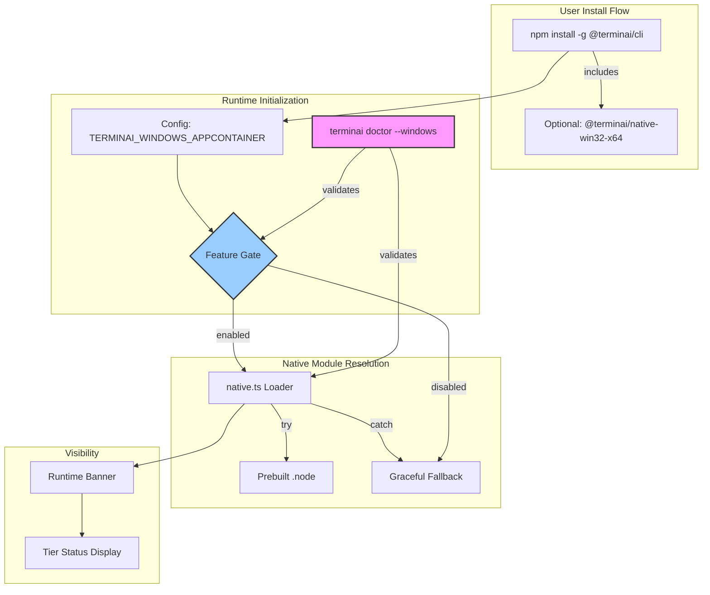
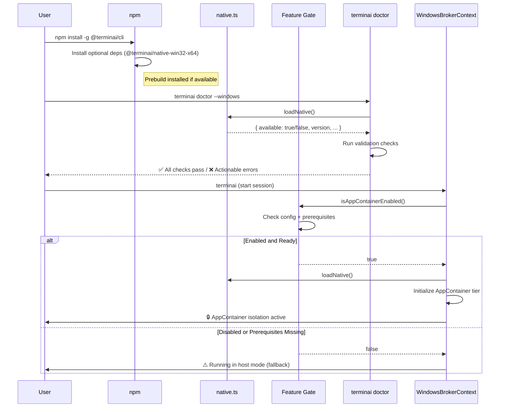

# Phase C: Productization — Technical Specification

> **Status**: Draft (v1.0)  
> **Version**: 1.0.0  
> **Date**: 2026-01-23  
> **Scope**: W6 (Native Distribution), W7 (Doctor Command), W8 (Fail-safe
> Enablement)  
> **Companion Docs**:
>
> - [roadmap-q1-window-appcontainer.md](../roadmap-q1-window-appcontainer.md)
> - [phase-a-infrastructure-spec.md](./phase-a-infrastructure-spec.md)
> - [phase-b-capability-spec.md](./phase-b-capability-spec.md)

---

## 1. Executive Summary

### What

Ship Windows AppContainer isolation to real users without breaking their
machines:

- **Native module prebuild/distribution strategy** that eliminates build-tool
  requirements for end users
- **`terminai doctor --windows`** acceptance suite for quick validation of
  AppContainer readiness
- **Fail-safe feature flag gating** to prevent partial enablement states and
  provide clear runtime visibility

### Why

Phases A and B are engineer-facing — they build infrastructure and capability.
Phase C is user-facing — it determines whether a non-developer Windows user can
actually install and use the AppContainer tier safely:

1. **Native modules currently require Visual Studio Build Tools** — unacceptable
   for mainstream adoption
2. **No validation path exists** — users have no way to know if AppContainer
   works on their machine before encountering failures
3. **Partial enablement is dangerous** — if initialization fails mid-way, users
   may end up with neither isolation NOR capability

### When

**Estimated Effort**: ~12 hours of focused agent implementation + ~3 hours human
validation

| Component                           | Agent Hours | Human Hours |
| ----------------------------------- | ----------- | ----------- |
| W6: Native Module Prebuild Strategy | 4h          | 1h          |
| W6: CI/CD Pipeline for Prebuilds    | 2h          | 0.5h        |
| W7: Doctor Command Implementation   | 3h          | 1h          |
| W8: Feature Flag Gating             | 2h          | 0.5h        |
| W8: Runtime Banner/UX               | 1h          | —           |

### Risk

| Risk                                              | Likelihood | Impact | Mitigation                                                             |
| ------------------------------------------------- | ---------- | ------ | ---------------------------------------------------------------------- |
| Prebuilt binaries trigger Defender heuristics     | Medium     | High   | Sign binaries; publish via npm optional deps (not download-at-install) |
| Native module ABI mismatch with user's Node       | Medium     | High   | Build for multiple Node ABI versions; use N-API for stability          |
| Doctor command gives false positive               | Low        | High   | Include end-to-end ping test, not just "module loads"                  |
| Feature flag disabled but Phase A/B code executes | Low        | Medium | Single gating point with explicit initialization check                 |

---

## 2. Architecture Overview

### 2.1 System Diagram — Productization Layer



### 2.2 Component Responsibilities

| Component                       | Responsibility                                                       |
| ------------------------------- | -------------------------------------------------------------------- |
| **Native Loader (`native.ts`)** | Platform detection, prebuild resolution, graceful fallback           |
| **Doctor Command**              | Validates all prerequisites, displays actionable diagnostics         |
| **Feature Gate**                | Single point of control for tier enablement; prevents partial states |
| **Runtime Banner**              | Displays active tier, isolation status, and brokered operations      |
| **Prebuild CI Job**             | Builds, signs, and publishes native modules for each platform/arch   |

### 2.3 Data Flow — Install to Runtime



### 2.4 External Dependencies

| Dependency         | Purpose                          | Current State                 |
| ------------------ | -------------------------------- | ----------------------------- |
| `prebuildify`      | Build prebuilt native modules    | ❌ Not configured             |
| `prebuild-install` | Install prebuilts at npm install | ❌ Not configured             |
| `node-addon-api`   | N-API compatibility layer        | ✅ Already in binding.gyp     |
| GitHub Actions     | CI/CD for prebuild artifacts     | ✅ Existing windows_build job |
| npm optional deps  | Distribute platform-specific     | ❌ Not configured             |

---

## 3. Technical Specification

---

### 3.1 W6: Native Module Distribution Strategy

#### 3.1.1 Purpose

Enable Windows users to use AppContainer tier **without installing Visual Studio
Build Tools**. The native module (`terminai_native.node`) must be prebuilt and
distributed.

#### 3.1.2 Design Decision: Optional Dependencies Strategy

> [!IMPORTANT] **Human Decision Required:** Choose distribution strategy.

**Option A: Optional Dependencies (Recommended)**

Publish platform-specific packages as npm optional dependencies:

```json
{
  "optionalDependencies": {
    "@terminai/native-win32-x64": "0.28.0",
    "@terminai/native-win32-arm64": "0.28.0"
  }
}
```

**Pros:**

- No "download binary at install time" behavior (Defender-friendly)
- Standard npm resolution, works with npm/yarn/pnpm
- Graceful fallback if optional dep unavailable

**Cons:**

- Multiple packages to maintain and version
- Slightly larger install footprint

**Option B: prebuild-install (Download at Install)**

Use `prebuild-install` to download from GitHub Releases:

```json
{
  "scripts": {
    "install": "prebuild-install || npm run build"
  }
}
```

**Pros:**

- Single package, smaller npm footprint
- Common pattern (used by `keytar`, `tree-sitter-bash`)

**Cons:**

- Download-at-install may trigger Defender heuristics
- Requires GitHub Releases infrastructure
- Network dependency at install time

**Recommendation:** Option A (Optional Dependencies) for Defender compatibility.

#### 3.1.3 Interface — Platform-Specific Packages

```typescript
// packages/native-win32-x64/package.json
{
  "name": "@terminai/native-win32-x64",
  "version": "0.28.0",
  "os": ["win32"],
  "cpu": ["x64"],
  "main": "terminai_native.node",
  "files": ["terminai_native.node"]
}

// packages/native-win32-arm64/package.json
{
  "name": "@terminai/native-win32-arm64",
  "version": "0.28.0",
  "os": ["win32"],
  "cpu": ["arm64"],
  "main": "terminai_native.node",
  "files": ["terminai_native.node"]
}
```

#### 3.1.4 Interface — Native Loader Enhancement

```typescript
// packages/cli/src/runtime/windows/native.ts

/**
 * Resolution order for native module:
 * 1. Platform-specific optional dependency (@terminai/native-{platform}-{arch})
 * 2. Local build (build/Release/terminai_native.node)
 * 3. Graceful unavailability (no crash)
 */
export interface NativeModuleStatus {
  available: boolean;
  source: 'prebuild' | 'local' | 'unavailable';
  version?: string;
  path?: string;
  error?: string;
}

export async function loadNative(): Promise<NativeModuleStatus> {
  // 1. Try platform-specific prebuild
  const prebuildPackage = `@terminai/native-${process.platform}-${process.arch}`;
  try {
    const prebuildPath = require.resolve(prebuildPackage);
    const native = require(prebuildPath);
    return {
      available: true,
      source: 'prebuild',
      version: native.version ?? 'unknown',
      path: prebuildPath,
    };
  } catch {
    // Prebuild not available, continue
  }

  // 2. Try local build
  try {
    const localPath = path.join(
      __dirname,
      '../../build/Release/terminai_native.node',
    );
    const native = require(localPath);
    return {
      available: true,
      source: 'local',
      version: native.version ?? 'unknown',
      path: localPath,
    };
  } catch {
    // Local build not available
  }

  // 3. Graceful unavailability
  return {
    available: false,
    source: 'unavailable',
    error: 'Native module not found. AppContainer tier unavailable.',
  };
}
```

#### 3.1.5 CI/CD Pipeline for Prebuilds

```yaml
# .github/workflows/native-prebuild.yml

name: 'Native Prebuild'

on:
  push:
    tags:
      - 'v*'
  workflow_dispatch:

jobs:
  build-windows-x64:
    runs-on: 'windows-latest'
    steps:
      - uses: 'actions/checkout@v4'
      - uses: 'actions/setup-node@v4'
        with:
          node-version-file: '.nvmrc'
      - uses: 'actions/setup-python@v5'
        with:
          python-version: '3.x'

      - name: 'Install dependencies'
        run: 'npm ci'

      - name: 'Build native module'
        run: 'npm run build:native'
        working-directory: 'packages/cli'

      - name: 'Package prebuild'
        run: |
          mkdir -p packages/native-win32-x64
          cp packages/cli/build/Release/terminai_native.node packages/native-win32-x64/
          cp scripts/native-package-template.json packages/native-win32-x64/package.json
          # Update package.json with version

      - name: 'Publish to npm'
        run: 'npm publish --access public'
        working-directory: 'packages/native-win32-x64'
        env:
          NODE_AUTH_TOKEN: '${{ secrets.NPM_TOKEN }}'

  build-windows-arm64:
    runs-on: 'windows-latest'
    # Similar to x64, with cross-compilation for ARM64
```

#### 3.1.6 Files Affected (W6)

| File                                         | Change                                                |
| -------------------------------------------- | ----------------------------------------------------- |
| `packages/cli/package.json`                  | **[MODIFY]** Add optionalDependencies                 |
| `packages/cli/src/runtime/windows/native.ts` | **[MODIFY]** Enhanced loader with prebuild resolution |
| `packages/native-win32-x64/package.json`     | **[NEW]** Platform package manifest                   |
| `packages/native-win32-arm64/package.json`   | **[NEW]** Platform package manifest                   |
| `.github/workflows/native-prebuild.yml`      | **[NEW]** CI job for prebuilds                        |
| `scripts/native-package-template.json`       | **[NEW]** Template for platform packages              |

---

### 3.2 W7: Doctor Command (`terminai doctor --windows`)

#### 3.2.1 Purpose

Provide a fast, actionable validation suite that tells users whether
AppContainer is ready on their machine. Must complete in <2 minutes and provide
clear remediation steps for any failures.

#### 3.2.2 Interface

```typescript
// packages/cli/src/commands/doctor/windowsDoctor.ts

export interface DoctorCheck {
  name: string;
  description: string;
  status: 'pass' | 'fail' | 'warn' | 'skip';
  message: string;
  remediation?: string;
  durationMs: number;
}

export interface DoctorResult {
  platform: 'win32';
  tier: 'appcontainer';
  timestamp: Date;
  checks: DoctorCheck[];
  overallStatus: 'ready' | 'not-ready' | 'degraded';
  summary: string;
}

/**
 * Run Windows AppContainer doctor checks.
 */
export async function runWindowsDoctor(): Promise<DoctorResult>;
```

#### 3.2.3 Doctor Checks Specification

```typescript
/**
 * Doctor checks in execution order.
 * Each check includes prerequisites — skip if prerequisites fail.
 */
const DOCTOR_CHECKS = [
  // ─────────────────────────────────────────────────────────────────────────
  // Check 1: Platform Verification
  // ─────────────────────────────────────────────────────────────────────────
  {
    id: 'platform',
    name: 'Windows Platform',
    description: 'Verify running on Windows',
    run: async () => {
      if (process.platform !== 'win32') {
        return { status: 'fail', message: 'Not running on Windows' };
      }
      const release = os.release();
      // AppContainer requires Windows 8+ (NT 6.2+)
      const [major, minor] = release.split('.').map(Number);
      if (major < 6 || (major === 6 && minor < 2)) {
        return {
          status: 'fail',
          message: `Windows ${release} too old`,
          remediation: 'AppContainer requires Windows 8 or later',
        };
      }
      return { status: 'pass', message: `Windows ${release}` };
    },
  },

  // ─────────────────────────────────────────────────────────────────────────
  // Check 2: Native Module Availability
  // ─────────────────────────────────────────────────────────────────────────
  {
    id: 'native-module',
    name: 'Native Module',
    description: 'Native module loads successfully',
    prerequisites: ['platform'],
    run: async () => {
      const status = await loadNative();
      if (!status.available) {
        return {
          status: 'fail',
          message: status.error ?? 'Native module not available',
          remediation:
            'Install Visual Studio Build Tools or ensure @terminai/native-win32-x64 is installed',
        };
      }
      return {
        status: 'pass',
        message: `Loaded from ${status.source} (${status.path})`,
      };
    },
  },

  // ─────────────────────────────────────────────────────────────────────────
  // Check 3: AppContainer Profile Creation
  // ─────────────────────────────────────────────────────────────────────────
  {
    id: 'appcontainer-profile',
    name: 'AppContainer Profile',
    description: 'Can create/derive AppContainer profile',
    prerequisites: ['native-module'],
    run: async () => {
      try {
        const native = await getNativeModule();
        const result = native.createAppContainerProfile('terminai-doctor-test');
        if (result < 0) {
          return {
            status: 'fail',
            message: `Profile creation failed (code ${result})`,
            remediation: 'Check Windows permissions; may require admin',
          };
        }
        // Clean up test profile
        native.deleteAppContainerProfile('terminai-doctor-test');
        return { status: 'pass', message: 'Profile creation successful' };
      } catch (error) {
        return {
          status: 'fail',
          message: (error as Error).message,
          remediation: 'Native module error; check installation',
        };
      }
    },
  },

  // ─────────────────────────────────────────────────────────────────────────
  // Check 4: SID Derivation
  // ─────────────────────────────────────────────────────────────────────────
  {
    id: 'sid-derivation',
    name: 'SID Derivation',
    description: 'Can derive AppContainer SID',
    prerequisites: ['native-module'],
    run: async () => {
      try {
        const native = await getNativeModule();
        const sid = native.deriveAppContainerSid('terminai-doctor-test');
        if (!sid || sid.length < 10) {
          return {
            status: 'fail',
            message: 'SID derivation returned invalid result',
          };
        }
        return { status: 'pass', message: `SID: ${sid.substring(0, 20)}...` };
      } catch (error) {
        return { status: 'fail', message: (error as Error).message };
      }
    },
  },

  // ─────────────────────────────────────────────────────────────────────────
  // Check 5: Workspace ACL Grant
  // ─────────────────────────────────────────────────────────────────────────
  {
    id: 'workspace-acl',
    name: 'Workspace ACL',
    description: 'Can grant workspace access to AppContainer',
    prerequisites: ['appcontainer-profile'],
    run: async () => {
      try {
        const native = await getNativeModule();
        const testDir = path.join(os.tmpdir(), 'terminai-doctor-workspace');
        await fs.mkdir(testDir, { recursive: true });
        const result = native.grantWorkspaceAccess(
          testDir,
          'terminai-doctor-test',
        );
        await fs.rm(testDir, { recursive: true, force: true });
        if (result < 0) {
          return {
            status: 'fail',
            message: `ACL grant failed (code ${result})`,
            remediation: 'Check directory permissions',
          };
        }
        return { status: 'pass', message: 'ACL grant successful' };
      } catch (error) {
        return { status: 'fail', message: (error as Error).message };
      }
    },
  },

  // ─────────────────────────────────────────────────────────────────────────
  // Check 6: Secure Pipe Creation (DACL)
  // ─────────────────────────────────────────────────────────────────────────
  {
    id: 'secure-pipe',
    name: 'Secure Pipe (DACL)',
    description: 'Can create named pipe with restricted DACL',
    prerequisites: ['sid-derivation'],
    run: async () => {
      try {
        const native = await getNativeModule();
        const testPipeName = `\\\\.\\pipe\\terminai-doctor-${Date.now()}`;
        const sid = native.deriveAppContainerSid('terminai-doctor-test');
        const pipeServer = native.createSecurePipeServer(testPipeName, sid);
        if (!pipeServer.listen()) {
          return {
            status: 'fail',
            message: 'Pipe creation with DACL failed',
            remediation: 'Check Windows security policy',
          };
        }
        pipeServer.close();
        return { status: 'pass', message: 'Secure pipe with DACL created' };
      } catch (error) {
        return { status: 'fail', message: (error as Error).message };
      }
    },
  },

  // ─────────────────────────────────────────────────────────────────────────
  // Check 7: Brain↔Hands Ping (End-to-End)
  // ─────────────────────────────────────────────────────────────────────────
  {
    id: 'brain-hands-ping',
    name: 'Brain↔Hands Ping',
    description: 'End-to-end IPC test (spawn Brain, handshake, ping)',
    prerequisites: ['secure-pipe', 'workspace-acl'],
    run: async () => {
      try {
        // Create minimal broker context for ping test
        const testWorkspace = path.join(os.tmpdir(), 'terminai-doctor-e2e');
        await fs.mkdir(testWorkspace, { recursive: true });

        const context = new WindowsBrokerContext({
          workspacePath: testWorkspace,
          sessionId: `doctor-${Date.now()}`,
          testMode: true, // Shorter timeouts
        });

        await context.initialize();
        const pingResult = await context.ping();
        await context.shutdown();
        await fs.rm(testWorkspace, { recursive: true, force: true });

        if (!pingResult.success) {
          return {
            status: 'fail',
            message: `Ping failed: ${pingResult.error}`,
            remediation: 'Check Brain entrypoint and IPC configuration',
          };
        }
        return {
          status: 'pass',
          message: `Ping successful (${pingResult.roundTripMs}ms)`,
        };
      } catch (error) {
        return {
          status: 'fail',
          message: (error as Error).message,
          remediation: 'End-to-end test failed; check logs for details',
        };
      }
    },
  },

  // ─────────────────────────────────────────────────────────────────────────
  // Check 8: Structured Execute Test
  // ─────────────────────────────────────────────────────────────────────────
  {
    id: 'structured-execute',
    name: 'Structured Execute',
    description: 'Execute command through broker (exec mode)',
    prerequisites: ['brain-hands-ping'],
    run: async () => {
      try {
        const testWorkspace = path.join(os.tmpdir(), 'terminai-doctor-exec');
        await fs.mkdir(testWorkspace, { recursive: true });

        const context = new WindowsBrokerContext({
          workspacePath: testWorkspace,
          sessionId: `doctor-exec-${Date.now()}`,
          testMode: true,
        });

        await context.initialize();
        const result = await context.execute({
          command: 'cmd.exe',
          args: ['/c', 'echo', 'doctor-test'],
          mode: 'exec',
          timeout: 5000,
        });
        await context.shutdown();
        await fs.rm(testWorkspace, { recursive: true, force: true });

        if (!result.success) {
          return {
            status: 'fail',
            message: `Execute failed: ${result.error}`,
          };
        }
        if (!result.data?.stdout?.includes('doctor-test')) {
          return {
            status: 'warn',
            message: 'Execute succeeded but output unexpected',
          };
        }
        return { status: 'pass', message: 'Structured execute works' };
      } catch (error) {
        return { status: 'fail', message: (error as Error).message };
      }
    },
  },

  // ─────────────────────────────────────────────────────────────────────────
  // Check 9: AMSI Availability
  // ─────────────────────────────────────────────────────────────────────────
  {
    id: 'amsi',
    name: 'AMSI Scanner',
    description: 'AMSI (Antimalware Scan Interface) available',
    prerequisites: ['native-module'],
    run: async () => {
      try {
        const native = await getNativeModule();
        if (!native.isAmsiAvailable || !native.isAmsiAvailable()) {
          return {
            status: 'warn',
            message: 'AMSI not available',
            remediation:
              'Script scanning disabled; ensure Windows Defender active',
          };
        }
        // Test scan with safe content
        const scanResult = native.amsiScanBuffer('echo hello', 'test.ps1');
        if (scanResult.result !== 0) {
          return {
            status: 'warn',
            message: 'AMSI scan returned unexpected result',
          };
        }
        return { status: 'pass', message: 'AMSI available and functional' };
      } catch (error) {
        return {
          status: 'warn',
          message: `AMSI check failed: ${(error as Error).message}`,
        };
      }
    },
  },

  // ─────────────────────────────────────────────────────────────────────────
  // Check 10: AMSI Blocks Known-Bad (Optional Validation)
  // ─────────────────────────────────────────────────────────────────────────
  {
    id: 'amsi-blocks',
    name: 'AMSI Blocks Malicious',
    description: 'AMSI correctly blocks EICAR test string',
    prerequisites: ['amsi'],
    run: async () => {
      try {
        const native = await getNativeModule();
        // EICAR test string (harmless but triggers AV)
        const eicar =
          'X5O!P%@AP[4\\PZX54(P^)7CC)7}$EICAR-STANDARD-ANTIVIRUS-TEST-FILE!$H+H*';
        const scanResult = native.amsiScanBuffer(eicar, 'eicar.txt');
        // AMSI_RESULT_DETECTED = 32768
        if (scanResult.result >= 32768) {
          return { status: 'pass', message: 'AMSI blocked EICAR test string' };
        }
        return {
          status: 'warn',
          message: 'AMSI did not block EICAR (Defender may be disabled)',
        };
      } catch (error) {
        return { status: 'skip', message: 'AMSI block test skipped' };
      }
    },
  },
];
```

#### 3.2.4 Doctor Output Format

```typescript
/**
 * Doctor output rendering.
 */
function renderDoctorResult(result: DoctorResult): void {
  console.log('\n🏥 TerminAI Windows AppContainer Doctor\n');
  console.log(`Platform: ${result.platform}`);
  console.log(`Tier: ${result.tier}`);
  console.log(`Time: ${result.timestamp.toISOString()}\n`);

  console.log('Checks:');
  console.log('─'.repeat(60));

  for (const check of result.checks) {
    const icon = {
      pass: '✅',
      fail: '❌',
      warn: '⚠️',
      skip: '⏭️',
    }[check.status];

    console.log(`${icon} ${check.name}`);
    console.log(`   ${check.message}`);
    if (check.remediation) {
      console.log(`   💡 ${check.remediation}`);
    }
    console.log(`   (${check.durationMs}ms)`);
  }

  console.log('─'.repeat(60));
  console.log(`\nOverall: ${result.overallStatus.toUpperCase()}`);
  console.log(result.summary);
}
```

**Example Output:**

```
🏥 TerminAI Windows AppContainer Doctor

Platform: win32
Tier: appcontainer
Time: 2026-01-23T17:15:00.000Z

Checks:
────────────────────────────────────────────────────────────
✅ Windows Platform
   Windows 10.0.22631
   (2ms)
✅ Native Module
   Loaded from prebuild (@terminai/native-win32-x64)
   (15ms)
✅ AppContainer Profile
   Profile creation successful
   (45ms)
✅ SID Derivation
   SID: S-1-15-2-12345678...
   (3ms)
✅ Workspace ACL
   ACL grant successful
   (28ms)
✅ Secure Pipe (DACL)
   Secure pipe with DACL created
   (12ms)
✅ Brain↔Hands Ping
   Ping successful (142ms)
   (1250ms)
✅ Structured Execute
   Structured execute works
   (890ms)
✅ AMSI Scanner
   AMSI available and functional
   (8ms)
✅ AMSI Blocks Malicious
   AMSI blocked EICAR test string
   (5ms)
────────────────────────────────────────────────────────────

Overall: READY
All checks passed! AppContainer isolation is ready to use.
Enable with: export TERMINAI_WINDOWS_APPCONTAINER=true
```

#### 3.2.5 CLI Integration

```typescript
// packages/cli/src/commands/doctor.ts

import yargs from 'yargs';
import { runWindowsDoctor } from './doctor/windowsDoctor.js';
import { runLinuxDoctor } from './doctor/linuxDoctor.js';

export const doctorCommand: yargs.CommandModule = {
  command: 'doctor',
  describe: 'Check system readiness for TerminAI features',
  builder: (yargs) =>
    yargs
      .option('windows', {
        alias: 'w',
        type: 'boolean',
        description: 'Run Windows AppContainer checks',
      })
      .option('linux', {
        alias: 'l',
        type: 'boolean',
        description: 'Run Linux container checks',
      })
      .option('json', {
        type: 'boolean',
        description: 'Output as JSON',
      }),
  handler: async (argv) => {
    if (argv.windows || process.platform === 'win32') {
      const result = await runWindowsDoctor();
      if (argv.json) {
        console.log(JSON.stringify(result, null, 2));
      } else {
        renderDoctorResult(result);
      }
      process.exit(result.overallStatus === 'ready' ? 0 : 1);
    }
    // ... linux doctor
  },
};
```

#### 3.2.6 Files Affected (W7)

| File                                                       | Change                                  |
| ---------------------------------------------------------- | --------------------------------------- |
| `packages/cli/src/commands/doctor.ts`                      | **[NEW]** Doctor command entry          |
| `packages/cli/src/commands/doctor/windowsDoctor.ts`        | **[NEW]** Windows doctor implementation |
| `packages/cli/src/commands/doctor/types.ts`                | **[NEW]** Shared types                  |
| `packages/cli/src/runtime/windows/WindowsBrokerContext.ts` | **[MODIFY]** Add `testMode`, `ping()`   |
| `packages/cli/src/index.ts` or yargs config                | **[MODIFY]** Register doctor command    |

---

### 3.3 W8: Fail-safe Feature Flag Gating

#### 3.3.1 Purpose

Ensure users never end up in a half-enabled AppContainer state that is both
insecure AND capability-nerfed. Provide:

1. **Single gating point** for tier enablement
2. **Clear runtime visibility** of active tier
3. **Safe fallback** to host mode if initialization fails

#### 3.3.2 Interface — Feature Gate

```typescript
// packages/cli/src/runtime/windows/featureGate.ts

/**
 * Result of feature gate check.
 */
export interface FeatureGateResult {
  enabled: boolean;
  tier: 'appcontainer' | 'managed-local' | 'host';
  reason: string;
  prerequisites?: {
    name: string;
    met: boolean;
    message: string;
  }[];
}

/**
 * Feature gate for Windows AppContainer tier.
 *
 * SINGLE POINT OF CONTROL: All tier enablement flows through here.
 * This prevents partial enablement states.
 */
export async function checkAppContainerGate(): Promise<FeatureGateResult> {
  // 1. Check explicit enablement
  const enabledEnv = process.env.TERMINAI_WINDOWS_APPCONTAINER;
  if (enabledEnv !== 'true') {
    return {
      enabled: false,
      tier: 'managed-local',
      reason: 'AppContainer not explicitly enabled',
    };
  }

  // 2. Check platform
  if (process.platform !== 'win32') {
    return {
      enabled: false,
      tier: 'host',
      reason: 'AppContainer requires Windows',
    };
  }

  // 3. Check critical prerequisites
  const prerequisites = await checkPrerequisites();
  const allMet = prerequisites.every((p) => p.met);

  if (!allMet) {
    const failed = prerequisites.filter((p) => !p.met);
    return {
      enabled: false,
      tier: 'managed-local',
      reason: `Prerequisites not met: ${failed.map((p) => p.name).join(', ')}`,
      prerequisites,
    };
  }

  return {
    enabled: true,
    tier: 'appcontainer',
    reason: 'All prerequisites met',
    prerequisites,
  };
}

async function checkPrerequisites(): Promise<
  FeatureGateResult['prerequisites']
> {
  const results: FeatureGateResult['prerequisites'] = [];

  // Check native module
  const nativeStatus = await loadNative();
  results.push({
    name: 'native-module',
    met: nativeStatus.available,
    message: nativeStatus.available
      ? `Loaded from ${nativeStatus.source}`
      : (nativeStatus.error ?? 'Not available'),
  });

  // Check if we can create AppContainer profile
  if (nativeStatus.available) {
    try {
      const native = await getNativeModule();
      const testResult = native.createAppContainerProfile('terminai-gate-test');
      native.deleteAppContainerProfile('terminai-gate-test');
      results.push({
        name: 'appcontainer-profile',
        met: testResult >= 0,
        message:
          testResult >= 0 ? 'Can create profiles' : `Error: ${testResult}`,
      });
    } catch (error) {
      results.push({
        name: 'appcontainer-profile',
        met: false,
        message: (error as Error).message,
      });
    }
  }

  return results;
}
```

#### 3.3.3 Interface — Runtime Banner

```typescript
// packages/cli/src/runtime/windows/runtimeBanner.ts

export interface RuntimeBannerInfo {
  tier: 'appcontainer' | 'managed-local' | 'host';
  isolated: boolean;
  brokeredOperations: string[];
  warnings: string[];
}

/**
 * Generate runtime banner information.
 */
export function getRuntimeBannerInfo(
  gateResult: FeatureGateResult,
): RuntimeBannerInfo {
  if (gateResult.tier === 'appcontainer') {
    return {
      tier: 'appcontainer',
      isolated: true,
      brokeredOperations: ['execute', 'spawn', 'file-write', 'network'],
      warnings: [],
    };
  }

  if (gateResult.tier === 'managed-local') {
    return {
      tier: 'managed-local',
      isolated: false,
      brokeredOperations: [],
      warnings: ['Running without AppContainer isolation', gateResult.reason],
    };
  }

  return {
    tier: 'host',
    isolated: false,
    brokeredOperations: [],
    warnings: ['Running in host mode (no isolation)'],
  };
}

/**
 * Render runtime banner to console.
 */
export function renderRuntimeBanner(info: RuntimeBannerInfo): void {
  const tierIcons = {
    appcontainer: '🔒',
    'managed-local': '⚡',
    host: '⚠️',
  };

  const tierNames = {
    appcontainer: 'AppContainer (Isolated)',
    'managed-local': 'Managed Local',
    host: 'Host Mode',
  };

  console.log(`\n${tierIcons[info.tier]} Runtime: ${tierNames[info.tier]}`);

  if (info.isolated) {
    console.log(`   Isolation: Active`);
    console.log(`   Brokered: ${info.brokeredOperations.join(', ')}`);
  }

  for (const warning of info.warnings) {
    console.log(`   ⚠️ ${warning}`);
  }

  console.log('');
}
```

#### 3.3.4 Behavior — Initialization with Fail-safe

```typescript
// packages/cli/src/runtime/windows/WindowsBrokerContext.ts (enhanced)

export class WindowsBrokerContext implements RuntimeContext {
  private initialized = false;
  private initializationFailed = false;
  private fallbackContext?: ManagedLocalContext;

  /**
   * Initialize with fail-safe behavior.
   *
   * If initialization fails at any point, we:
   * 1. Log the failure clearly
   * 2. Do NOT partially enable
   * 3. Fall back to ManagedLocalContext
   * 4. Display warning banner
   */
  async initialize(): Promise<void> {
    // 1. Check feature gate
    const gateResult = await checkAppContainerGate();
    if (!gateResult.enabled) {
      console.warn(`AppContainer not enabled: ${gateResult.reason}`);
      this.initializeFallback();
      return;
    }

    try {
      // 2. Create AppContainer profile
      await this.createProfile();

      // 3. Grant workspace ACL
      await this.grantWorkspaceAccess();

      // 4. Start broker server with secure pipe
      await this.startBrokerServer();

      // 5. Spawn Brain process
      await this.spawnBrain();

      // 6. Complete handshake
      await this.completeHandshake();

      // 7. Mark as initialized
      this.initialized = true;

      // 8. Display banner
      const bannerInfo = getRuntimeBannerInfo(gateResult);
      renderRuntimeBanner(bannerInfo);
    } catch (error) {
      // FAIL-SAFE: Any failure triggers complete fallback
      console.error(
        `AppContainer initialization failed: ${(error as Error).message}`,
      );
      console.error('Falling back to Managed Local runtime');

      // Clean up any partial state
      await this.cleanup();

      // Initialize fallback
      this.initializeFallback();
      this.initializationFailed = true;
    }
  }

  private async initializeFallback(): Promise<void> {
    this.fallbackContext = new ManagedLocalContext({
      workspacePath: this.workspacePath,
    });
    await this.fallbackContext.initialize();

    const bannerInfo: RuntimeBannerInfo = {
      tier: 'managed-local',
      isolated: false,
      brokeredOperations: [],
      warnings: ['Running without AppContainer isolation'],
    };
    renderRuntimeBanner(bannerInfo);
  }

  /**
   * Execute delegates to fallback if initialization failed.
   */
  async execute(request: ExecuteRequest): Promise<ExecuteResponse> {
    if (this.fallbackContext) {
      return this.fallbackContext.execute(request);
    }

    if (!this.initialized) {
      throw new Error('WindowsBrokerContext not initialized');
    }

    return this.handleExecute(request);
  }
}
```

#### 3.3.5 Configuration Interface

```typescript
// packages/cli/src/config/windowsConfig.ts

/**
 * Windows-specific configuration.
 */
export interface WindowsConfig {
  /**
   * Enable AppContainer isolation tier.
   * Requires Windows 8+ and native module.
   *
   * @env TERMINAI_WINDOWS_APPCONTAINER
   * @default false
   */
  appContainerEnabled: boolean;

  /**
   * Default tier when AppContainer disabled or unavailable.
   *
   * @env TERMINAI_WINDOWS_FALLBACK_TIER
   * @default 'managed-local'
   */
  fallbackTier: 'managed-local' | 'host';

  /**
   * Show runtime banner at startup.
   *
   * @env TERMINAI_SHOW_RUNTIME_BANNER
   * @default true
   */
  showRuntimeBanner: boolean;

  /**
   * Fail hard if AppContainer enabled but prerequisites not met.
   * If false, falls back gracefully.
   *
   * @env TERMINAI_APPCONTAINER_STRICT
   * @default false
   */
  strictMode: boolean;
}

export function loadWindowsConfig(): WindowsConfig {
  return {
    appContainerEnabled: process.env.TERMINAI_WINDOWS_APPCONTAINER === 'true',
    fallbackTier:
      (process.env.TERMINAI_WINDOWS_FALLBACK_TIER as
        | 'managed-local'
        | 'host') ?? 'managed-local',
    showRuntimeBanner: process.env.TERMINAI_SHOW_RUNTIME_BANNER !== 'false',
    strictMode: process.env.TERMINAI_APPCONTAINER_STRICT === 'true',
  };
}
```

#### 3.3.6 Files Affected (W8)

| File                                                       | Change                                      |
| ---------------------------------------------------------- | ------------------------------------------- |
| `packages/cli/src/runtime/windows/featureGate.ts`          | **[NEW]** Feature gate implementation       |
| `packages/cli/src/runtime/windows/runtimeBanner.ts`        | **[NEW]** Runtime banner display            |
| `packages/cli/src/config/windowsConfig.ts`                 | **[NEW]** Windows configuration             |
| `packages/cli/src/runtime/windows/WindowsBrokerContext.ts` | **[MODIFY]** Fail-safe init, fallback logic |

---

## 4. Data Models

```typescript
// ============================================================================
// Native Module Status
// ============================================================================

interface NativeModuleStatus {
  available: boolean;
  source: 'prebuild' | 'local' | 'unavailable';
  version?: string;
  path?: string;
  error?: string;
}

// ============================================================================
// Doctor Check Types
// ============================================================================

interface DoctorCheck {
  name: string;
  description: string;
  status: 'pass' | 'fail' | 'warn' | 'skip';
  message: string;
  remediation?: string;
  durationMs: number;
}

interface DoctorResult {
  platform: 'win32' | 'linux' | 'darwin';
  tier: 'appcontainer' | 'container' | 'host';
  timestamp: Date;
  checks: DoctorCheck[];
  overallStatus: 'ready' | 'not-ready' | 'degraded';
  summary: string;
}

// ============================================================================
// Feature Gate Types
// ============================================================================

interface FeatureGateResult {
  enabled: boolean;
  tier: 'appcontainer' | 'managed-local' | 'host';
  reason: string;
  prerequisites?: {
    name: string;
    met: boolean;
    message: string;
  }[];
}

// ============================================================================
// Runtime Banner Types
// ============================================================================

interface RuntimeBannerInfo {
  tier: 'appcontainer' | 'managed-local' | 'host';
  isolated: boolean;
  brokeredOperations: string[];
  warnings: string[];
}

// ============================================================================
// Windows Configuration
// ============================================================================

interface WindowsConfig {
  appContainerEnabled: boolean;
  fallbackTier: 'managed-local' | 'host';
  showRuntimeBanner: boolean;
  strictMode: boolean;
}
```

---

## 5. Security Considerations

### 5.1 Native Module Distribution Security

| Control                 | Implementation                                          | Notes                      |
| ----------------------- | ------------------------------------------------------- | -------------------------- |
| **Code Signing**        | Sign prebuilt .node files with code signing certificate | Prevents tampering         |
| **Checksum Validation** | Verify SHA256 hash at load time                         | Detect corrupted downloads |
| **npm Provenance**      | Publish with npm provenance (SLSA Level 3)              | Verifiable build chain     |
| **No Install Scripts**  | Prebuilts are static files, no postinstall scripts      | Defender-friendly          |

### 5.2 Doctor Command Security

| Control                  | Implementation                             | Notes                             |
| ------------------------ | ------------------------------------------ | --------------------------------- |
| **Test Isolation**       | Doctor creates temp directories for tests  | No side effects on real workspace |
| **Cleanup on Exit**      | All test artifacts cleaned up after checks | No leftover profiles/pipes        |
| **No Secrets in Output** | SID truncated, paths sanitized in logs     | Safe to share doctor output       |

### 5.3 Feature Flag Security

| Control                   | Implementation                                 | Notes                               |
| ------------------------- | ---------------------------------------------- | ----------------------------------- |
| **Explicit Enablement**   | Requires `TERMINAI_WINDOWS_APPCONTAINER=true`  | No accidental enablement            |
| **All-or-Nothing Init**   | Partial failure triggers complete fallback     | No half-isolated state              |
| **Visible Tier Status**   | Banner always shows active tier                | User knows current security posture |
| **Strict Mode Available** | `TERMINAI_APPCONTAINER_STRICT=true` fails hard | For security-conscious deployments  |

---

## 6. Testing Strategy

### 6.1 Unit Tests

| Component            | Test Cases                                                     |
| -------------------- | -------------------------------------------------------------- |
| **native.ts Loader** | Prebuild resolution, local fallback, graceful unavailability   |
| **featureGate.ts**   | Enabled/disabled states, prerequisite checking, fallback logic |
| **windowsDoctor.ts** | Each check passes/fails as expected, remediation messages      |
| **runtimeBanner.ts** | Correct icons and messages for each tier                       |

**Test Commands:**

```bash
npm run test -- packages/cli/src/runtime/windows/native.test.ts
npm run test -- packages/cli/src/runtime/windows/featureGate.test.ts
npm run test -- packages/cli/src/commands/doctor/windowsDoctor.test.ts
```

### 6.2 Integration Tests

| Test                      | Description                                               |
| ------------------------- | --------------------------------------------------------- |
| **Prebuild Installation** | `npm install` resolves correct platform prebuild          |
| **Doctor Full Run**       | All 10 checks execute and produce valid results           |
| **Feature Gate → Init**   | Gate result correctly drives initialization path          |
| **Fallback on Failure**   | Simulate native module failure, verify fallback activates |
| **Banner Display**        | Correct banner shown for each tier                        |

### 6.3 Manual Verification

| Step                                               | Expected Result                        | Who   |
| -------------------------------------------------- | -------------------------------------- | ----- |
| 1. Fresh Windows install, `npm i -g @terminai/cli` | Prebuild installed without build tools | Human |
| 2. Run `terminai doctor --windows`                 | All checks pass on consumer laptop     | Human |
| 3. Run with `TERMINAI_WINDOWS_APPCONTAINER=true`   | AppContainer banner displayed          | Human |
| 4. Rename native module, run again                 | Graceful fallback, warning banner      | Human |
| 5. Run doctor on Windows 7 (if available)          | Fails with "Windows too old" message   | Human |

---

## 7. Migration / Rollout Plan

### 7.1 Backward Compatibility

| Change                    | Compatibility       | Notes                                       |
| ------------------------- | ------------------- | ------------------------------------------- |
| Add optional dependencies | Backward compatible | npm ignores if not available                |
| Enhanced native loader    | Backward compatible | Falls back gracefully                       |
| New doctor command        | Addition only       | New CLI command, no breaking changes        |
| Feature gate              | Backward compatible | Default is off; existing behavior unchanged |
| Runtime banner            | Addition only       | New visual, no functional change            |

### 7.2 Rollout Phases

1. **Phase C.1: Native Distribution**
   - Publish `@terminai/native-win32-x64` and `@terminai/native-win32-arm64`
   - Update `@terminai/cli` with optional dependencies
   - Validate prebuild installation on clean Windows machines

2. **Phase C.2: Doctor Command**
   - Ship `terminai doctor --windows`
   - Document in README and getting-started guide
   - Collect feedback on check coverage

3. **Phase C.3: Feature Gate & Banner**
   - Enable via `TERMINAI_WINDOWS_APPCONTAINER=true`
   - Runtime banner shows tier status
   - Fail-safe fallback on initialization errors

### 7.3 Feature Flags

| Flag                             | Purpose                                     | Default         |
| -------------------------------- | ------------------------------------------- | --------------- |
| `TERMINAI_WINDOWS_APPCONTAINER`  | Enable AppContainer tier                    | `false`         |
| `TERMINAI_WINDOWS_FALLBACK_TIER` | Fallback tier when AppContainer unavailable | `managed-local` |
| `TERMINAI_SHOW_RUNTIME_BANNER`   | Show tier banner at startup                 | `true`          |
| `TERMINAI_APPCONTAINER_STRICT`   | Fail hard if prerequisites not met          | `false`         |

### 7.4 Rollback Procedure

If Phase C causes issues:

1. Disable via `TERMINAI_WINDOWS_APPCONTAINER=false` (immediate)
2. Remove optional dependencies from `@terminai/cli` (next release)
3. Falls back to Managed Local Runtime (Tier 2)
4. No data migration required — all state is ephemeral

---

## 8. Resolved Decisions

> [!NOTE] **All key decisions resolved (2026-01-23)**

| #   | Decision                         | Resolution                                                                                       |
| --- | -------------------------------- | ------------------------------------------------------------------------------------------------ |
| 1   | **Native distribution strategy** | **Option A (optional deps)** — avoids install-time binary fetching, deterministic failure modes  |
| 2   | **Default tier for Windows**     | **`managed-local`** — host only via explicit `TERMINAI_WINDOWS_FALLBACK_TIER=host` + loud banner |
| 3   | **Doctor check timeout**         | **60s total** — sufficient for E2E ping test                                                     |
| 4   | **Strict mode default**          | **No** — warn by default, block only when `TERMINAI_APPCONTAINER_STRICT=true`                    |
| 5   | **Code signing requirement**     | **Required for CI** (block publish if signing fails), **warn at runtime** (block only in strict) |
| 6   | **arm64 scope**                  | **x64 only for Phase C** — arm64 deferred to follow-up phase (requires real arm64 runner)        |

---

## 9. Prerequisite Tasks (Must Complete Before Phase C)

> [!WARNING] **Native API mismatch identified.** Doctor/gate code calls APIs
> that don't exist in current native module.

### 9.1 Native Module API Alignment

The spec references APIs that need to be added OR the doctor/gate must be
rewritten to use existing APIs:

| Spec Calls                           | Current Native Module Exports         | Action Required                  |
| ------------------------------------ | ------------------------------------- | -------------------------------- |
| `createAppContainerProfile(name)`    | `createAppContainerSandbox(cmd, ...)` | Add OR use sandbox directly      |
| `deriveAppContainerSid(name)`        | `getAppContainerSid(name)`            | **Rename in spec** (API exists)  |
| `native.version`                     | Not exported                          | **Add version export to native** |
| `grantWorkspaceAccess(dir, profile)` | ACL grant via sandbox creation        | Verify existing API suffices     |
| `createSecurePipeServer(name, sid)`  | Not implemented yet (Phase A W2)      | Phase A must complete first      |

**Resolution:** Add **Task 0** to extend native module with missing exports OR
rewrite doctor checks to use existing exports.

### 9.2 Optional Dependencies Placement

Optional dependencies must be added to BOTH:

- `packages/terminai/package.json` (user-installed wrapper) — **required**
- `packages/cli/package.json` (internal) — optional, for local dev

### 9.3 ESM Loader Compatibility

The current `native.ts` already uses `createRequire()`. Verify this pattern is
preserved in the enhanced loader.

---

## Summary

1. **W6 (Native Distribution)**: Publish platform-specific packages
   (`@terminai/native-win32-x64`, `@terminai/native-win32-arm64`) as npm
   optional dependencies; enhanced loader tries prebuild → local → graceful
   unavailability

2. **W6 (CI/CD)**: New GitHub Actions workflow builds and publishes prebuilds on
   version tags; consider code signing for Defender compatibility

3. **W7 (Doctor Command)**: `terminai doctor --windows` runs 10 checks covering
   platform, native module, AppContainer APIs, IPC, and AMSI; completes in <2
   min with actionable remediation messages

4. **W8 (Feature Gate)**: Single gating point via `checkAppContainerGate()`
   prevents partial enablement; explicit `TERMINAI_WINDOWS_APPCONTAINER=true`
   required

5. **W8 (Fail-safe)**: If initialization fails at any point, complete fallback
   to `ManagedLocalContext`; no half-isolated states

6. **W8 (Visibility)**: Runtime banner displays active tier, isolation status,
   and brokered operations at startup

7. **Security**: Code signing for prebuilds, cleanup of doctor artifacts,
   visible tier status, strict mode option for security-conscious users
